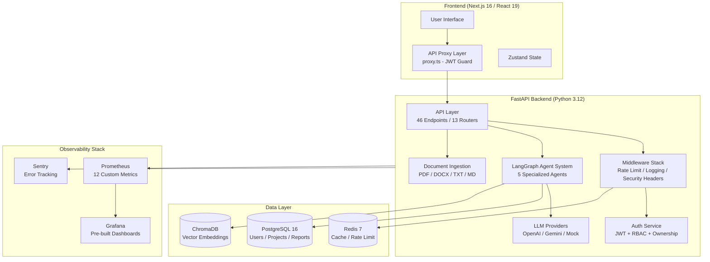
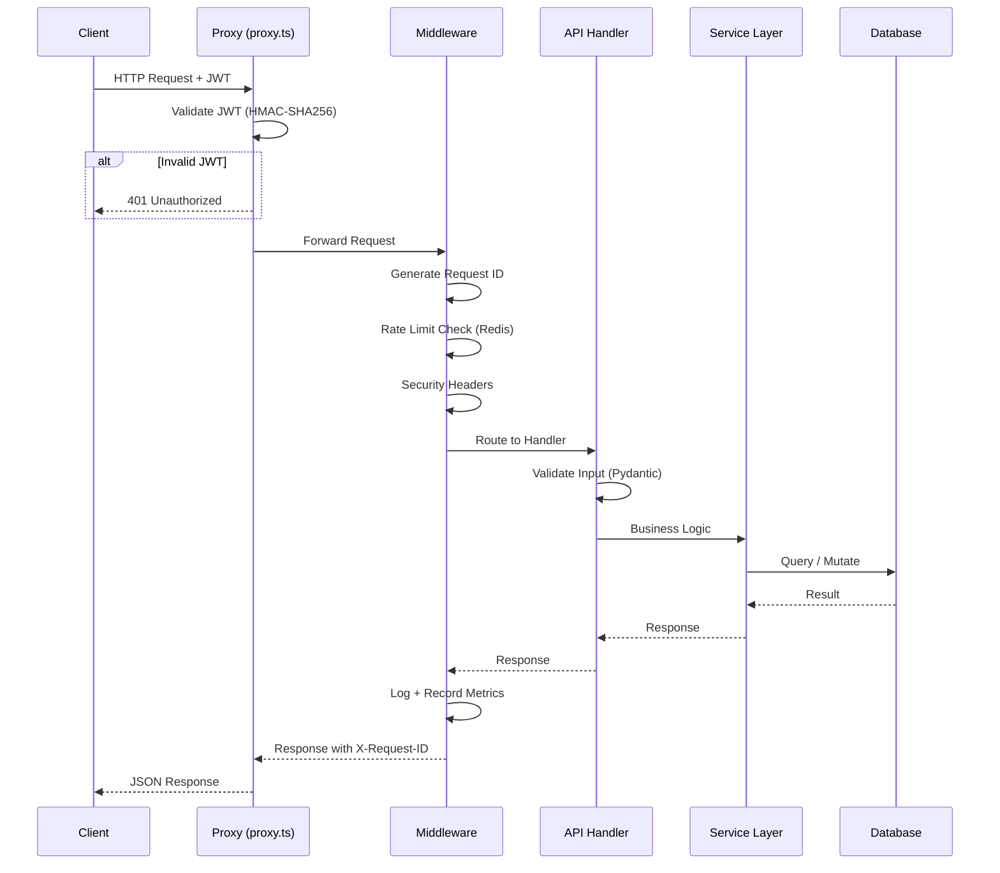
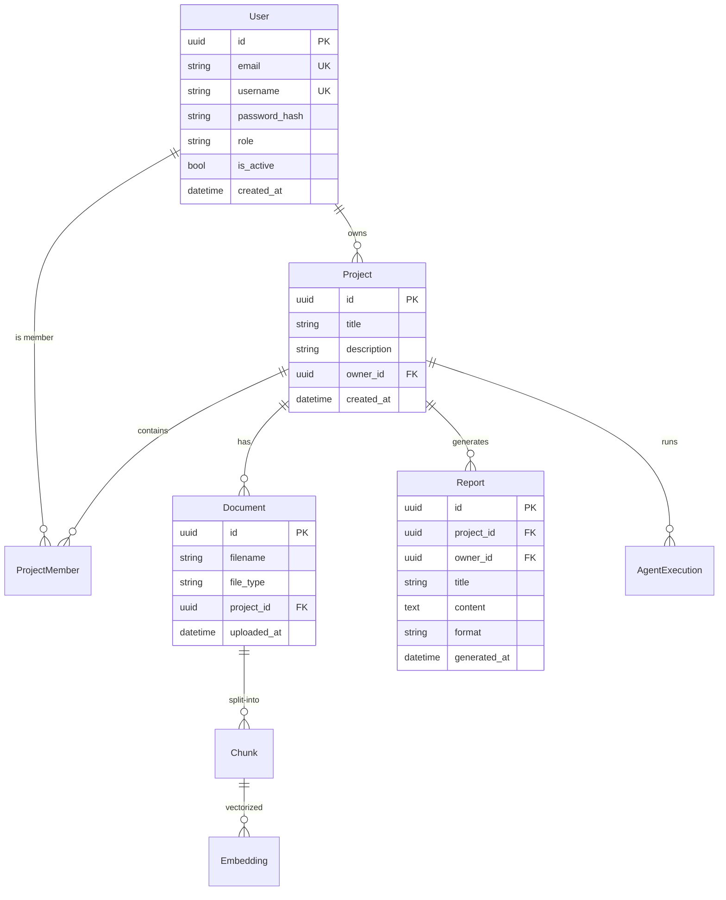

# AARA Architecture

## System Overview

AARA (Agentic AI Research Assistant) is a multi-agent research platform built on a **Next.js 16 frontend** and **FastAPI backend** with **LangGraph agent orchestration**.

```
User Query -> Planner -> Retriever -> Summarizer -> Gap Analyzer -> Report Generator -> Final Report
```

Each agent has a distinct role, and outputs are grounded in actual sources with confidence scores, citation tracking, and transparent reasoning traces.

---

## Architecture Diagram



---

## Request Lifecycle



---

## Agent Architecture

| Agent | Role | Input | Output |
|-------|------|-------|--------|
| **Planner** | Analyzes query, generates structured research plan | User query | Research plan with subtopics, search queries, methodology |
| **Retriever** | Searches ChromaDB + web for relevant papers | Research plan | Ranked paper list with abstracts and relevance scores |
| **Summarizer** | Synthesizes retrieved papers into themes | Paper list | Thematic summary with key findings per subtopic |
| **Gap Analyzer** | Identifies research gaps and opportunities | Thematic summary | 5-10 research gaps with severity, confidence, remediation |
| **Report Generator** | Produces structured final report | All agent outputs | Publication-quality report with citations, contradictions, executive summary |

---

## Security Architecture (Defense-in-Depth)

```
Layer 1: proxy.ts (Edge)
  - Reads JWT from auth_token cookie
  - Verifies HMAC-SHA256 signature
  - Validates exp and sub claims
  - Redirects to login if invalid

Layer 2: API Client Interceptor (Browser)
  - Attaches Bearer token to every request
  - Detects 401 responses, queues concurrent 401s
  - Silent token refresh via /auth/refresh

Layer 3: FastAPI Middleware (Backend)
  - Rate limiting with Redis (Lua scripting, TOCTOU-free)
  - Security headers (HSTS, CSP, XFO)
  - Structured JSON logging with correlation IDs

Layer 4: Service Layer (Backend)
  - JWT decode + signature verification
  - Token type check (access vs refresh)
  - Token version check (global invalidation)
  - RBAC enforcement (require_role)
  - Ownership verification (require_ownership)
```

---

## Data Model



---

## Key Design Decisions

1. **LangGraph over LangChain** — finer-grained control over agent state and workflow transitions
2. **proxy.ts over Next.js middleware** — avoids Next.js 16 middleware deprecation; provides custom JWT validation at edge
3. **Pluggable LLM providers** — supports OpenAI, Gemini, and Mock providers via strategy pattern
4. **Graceful degradation** — Redis, ChromaDB, and LLM failures don't crash the system; fallback modes maintain core functionality
5. **SQLAlchemy async** — non-blocking database access for high concurrency

---

## Technology Stack

| Layer | Technology |
|-------|------------|
| Frontend | Next.js 16, React 19, TypeScript 5.7, Tailwind CSS v4, Zustand |
| Backend | Python 3.12, FastAPI 0.115, SQLAlchemy 2.0, Pydantic v2 |
| AI/ML | LangGraph, ChromaDB, Gemini 2.0 Flash, OpenAI GPT-4o |
| Database | PostgreSQL 16, Redis 7 |
| Infrastructure | Docker, Docker Compose, GitHub Actions |
| Observability | Prometheus, Grafana, Sentry |
