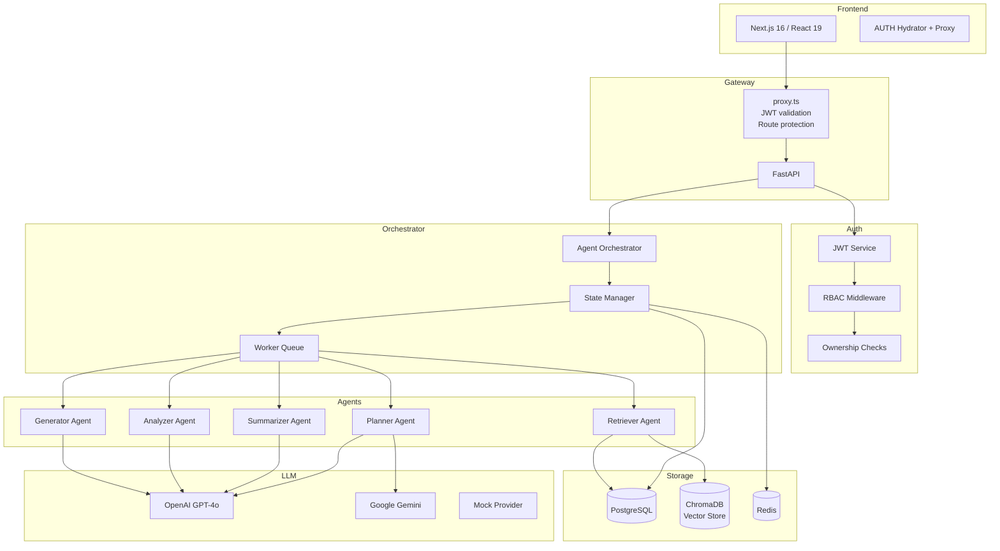

# AARA — Agentic AI Research Assistant

**An autonomous multi-agent system that discovers academic papers, identifies research gaps, and generates novel research directions — with transparent, evidence-backed reasoning at every step.**

[](https://www.python.org/)
[](https://fastapi.tiangolo.com/)
[](https://react.dev/)
[](https://www.typescriptlang.org/)
[](https://nextjs.org/)
[](https://www.postgresql.org/)
[](https://www.docker.com/)
[](https://jwt.io/)
[](LICENSE.md)

---

## Why AARA?

Research today moves fast — but the tools haven't kept up. Academics and R&D teams spend weeks reading papers, synthesizing themes, and trying to spot where the real gaps are. Chatbots can summarize, but they can't **reason** about research or **plan** a multi-step investigation.

AARA is different. Instead of a single Q&A model, it runs a **coordinated team of specialized agents** — each with a distinct role — that work through a structured research process:

1. **Plan** the investigation
2. **Retrieve** relevant papers
3. **Summarize** findings
4. **Analyze** for gaps
5. **Generate** novel directions

Each agent's output is grounded in actual sources and presented with explainable evidence panels so you can verify every claim.

---

## Features

| Feature | What it does |
|---|---|
| **Multi-Agent Architecture** | Five specialized agents (Planner, Retriever, Summarizer, Analyzer, Generator) collaborate on a research task |
| **Research Planning** | An agent analyzes your topic and generates a structured investigation plan with search queries |
| **Retrieval-Augmented Generation** | Papers are fetched from academic sources, chunked, embedded, and stored in a vector database for semantic search |
| **Gap Analysis** | The Analyzer agent identifies 5-10 research gaps with severity ratings and confidence scores |
| **Novel Direction Generation** | The Generator agent proposes innovative research directions grounded in identified gaps |
| **Evidence Panels** | Every finding includes source citations, supporting evidence, agent reasoning summary, and confidence score |
| **Explainable AI** | Agent decision traces are surfaced in the UI — no black boxes |
| **JWT Authentication** | Access + refresh token rotation with silent refresh; 30-min access token, 7-day refresh token |
| **Role-Based Access Control** | Admin, Researcher, and Viewer roles enforced at every endpoint |
| **Ownership Validation** | Users can only access their own projects; enforced at the API level |
| **Report Generation** | Template-based reports (academic, executive, comprehensive) with export to multiple formats |
| **Citation Management** | APA, MLA, Chicago, and BibTeX — generated and exportable |
| **Real-Time Agent Monitoring** | Live execution dashboard with agent timelines and inter-agent communication graphs |
| **Docker Deployment** | Single `docker compose up` for the full stack |

---

## System Architecture



### Data Flow

```
User Input → proxy.ts (JWT check) → FastAPI → Auth (JWT + RBAC + Ownership)
    → Agent Orchestrator → State Manager
    → Planner → Retriever → Summarizer → Analyzer → Generator
    → Results persisted to PostgreSQL
    → Findings streamed to frontend via REST
```

---

## Tech Stack

### Frontend

| Technology | Purpose |
|---|---|
| Next.js 16 | App Router, Server Components, proxy.ts |
| React 19 | UI components, hooks, Suspense |
| TypeScript 5.7 | Full type safety across the codebase |
| Tailwind CSS v4 | Utility-first styling with design tokens |
| Zustand | Global auth state, research state, UI state |
| Axios | HTTP client with interceptor-based token refresh |
| Framer Motion | Page transitions and micro-interactions |
| Recharts | Agent execution timeline charts |
| Lucide React | Icon system |

### Backend

| Technology | Purpose |
|---|---|
| Python 3.12 | Runtime |
| FastAPI | REST framework with async support |
| SQLAlchemy 2.0 | Async ORM with PostgreSQL |
| Pydantic v2 | Request/response validation |
| Alembic | Database migrations |
| LangGraph | Agent workflow orchestration |
| Python-jose | JWT creation and HMAC-SHA256 verification |
| Dramatiq | Background task queue |
| ChromaDB | Vector similarity search |
| pytest | 360+ tests across auth, API, security, agents |

### Infrastructure

| Technology | Purpose |
|---|---|
| PostgreSQL 16 | Primary database |
| Docker Compose | Local development and staging |
| Prometheus + Grafana | Metrics and dashboards (staging) |
| Redis | Rate limiting and cache (optional) |

---

## Project Structure

```
aara/
├── app/                        # Next.js App Router pages
│   ├── auth/                   # Login / Signup
│   ├── dashboard/              # Main dashboard
│   ├── research/               # Papers, literature, gaps, directions, citations, reports
│   │   ├── gaps/               # Gap analysis with evidence panels
│   │   ├── papers/             # Paper search and management
│   │   └── monitoring/         # Real-time agent execution dashboard
│   └── settings/               # Account and preferences
├── backend/
│   ├── app/
│   │   ├── api/                # Route handlers (auth, projects, agents, reports)
│   │   ├── core/               # Config, security (JWT), logging
│   │   ├── graphs/             # LangGraph agent workflows
│   │   ├── llm/                # LLM providers (OpenAI, Gemini, Mock)
│   │   ├── models/             # SQLAlchemy ORM models
│   │   ├── schemas/            # Pydantic request/response schemas
│   │   ├── services/           # Business logic (auth, projects, agents)
│   │   ├── workers/            # Dramatiq background workers
│   │   └── main.py             # FastAPI app factory with lifespan validation
│   ├── tests/                  # 360+ pytest tests
│   ├── alembic/                # Database migrations
│   └── docker-compose.yml      # Full stack deployment
├── components/                 # Reusable React components
├── lib/                        # Shared utilities
│   ├── api-client.ts           # Axios with token refresh interceptor
│   ├── store.ts                # Zustand stores (auth, research, UI)
│   └── types.ts                # TypeScript type definitions
├── proxy.ts                    # Next.js proxy — JWT validation + route protection
├── public/                     # Static assets
└── docs/                       # Documentation archive
```

---

## Security Architecture

Authentication and authorization were designed as a defense-in-depth system — multiple independent layers, each enforcing its own check.

```
Layer 1: proxy.ts (Edge)
├── Reads JWT from auth_token cookie
├── Verifies HMAC-SHA256 signature using JWT_SECRET
├── Validates exp claim and sub claim
└── Redirects to login if invalid

Layer 2: API Client Interceptor (Browser)
├── Attaches Bearer token to every request
├── Detects 401 responses
├── Attempts silent token refresh via /auth/refresh
├── Queues concurrent 401s (single refresh for N requests)
└── Redirects to login only if refresh fails

Layer 3: FastAPI JWT Middleware (Backend)
├── python-jose jwt.decode() with SECRET_KEY
├── HMAC-SHA256 signature verification
├── Token type check (access vs refresh)
├── Token version check (invalidation support)
└── User existence verification in PostgreSQL

Layer 4: RBAC + Ownership (Backend)
├── require_role() decorator (admin / researcher / viewer)
├── _check_execution_owner() for resource-level access
└── Enforced on every protected endpoint (16+ routes)
```

### Key Design Decisions

- **Refresh token rotation:** Every `/auth/refresh` call returns a new refresh token. Old tokens are discarded. Mitigates stolen token reuse.
- **Fail-closed on misconfiguration:** If `JWT_SECRET` is not set, the proxy blocks all requests and logs a fatal error. No silent degradation.
- **Cross-tab sync:** A `storage` event listener in the auth hydrator keeps authentication state consistent across all browser tabs.
- **HMAC-SHA256 at two layers:** Both the Next.js proxy (Node.js `crypto`) and the backend (python-jose) independently verify the JWT signature using the same secret key.

---

## API Overview

### Authentication

```
POST /auth/register     Register new user
POST /auth/login        Login, receive access + refresh tokens
POST /auth/refresh      Rotate token pair
GET  /auth/me           Current user profile (JWT required)
```

### Projects

```
GET    /projects             List user's projects
POST   /projects             Create research project
GET    /projects/{id}        Get project (ownership check)
PUT    /projects/{id}        Update project (ownership check)
DELETE /projects/{id}        Delete project (ownership check)
```

### Agents & Research

```
POST   /projects/{id}/agents          Start agent execution
GET    /projects/{id}/agents          List agents for project
GET    /agents/{id}                   Get agent status
GET    /projects/{id}/literature      Literature review results
GET    /projects/{id}/gaps            Gap analysis results
GET    /projects/{id}/directions      Novel directions results
POST   /projects/{id}/report          Generate report
```

### Evaluation (Admin)

```
GET    /evaluation/overview           System-wide metrics
GET    /evaluation/agents             Agent-level metrics
GET    /evaluation/benchmarks         Benchmark results
```

---

## Local Development

### Prerequisites

- Python 3.12+
- Node.js 20+
- Docker & Docker Compose (for PostgreSQL)

### 1. Clone

```bash
git clone https://github.com/your-username/aara.git
cd aara
```

### 2. Backend Setup

```bash
cd backend

# Create virtual environment
python -m venv venv
source venv/bin/activate  # Linux/Mac
# .\venv\Scripts\Activate.ps1  # Windows

# Install dependencies
pip install -r requirements.txt

# Configure environment
cp .env.example .env
# Edit .env — set SECRET_KEY to a secure random string (min 32 chars)

# Start PostgreSQL
docker compose up -d db

# Run migrations
alembic upgrade head

# Start the API server
uvicorn app.main:app --reload --port 8000
```

### 3. Frontend Setup

```bash
# From project root
npm install

# Configure environment
echo "NEXT_PUBLIC_API_URL=http://localhost:8000/api" > .env.local
echo "JWT_SECRET=your-secret-key-matching-backend" >> .env.local

# Start dev server
npm run dev
```

### 4. Verify

- Frontend: http://localhost:3000
- Backend API: http://localhost:8000/docs
- Health check: http://localhost:8000/health

---

## Docker Deployment

```bash
# Full stack (backend + database)
cd backend
docker compose up --build

# With monitoring stack (Prometheus + Grafana)
docker compose -f docker-compose.yml -f docker-compose.staging.yml up
```

For production, set the following environment variables:

| Variable | Required | Description |
|---|---|---|
| `SECRET_KEY` | Yes | 32+ char random string for JWT signing |
| `JWT_SECRET` | Yes | Must match SECRET_KEY (used by proxy.ts) |
| `DATABASE_URL` | Yes | PostgreSQL connection string |
| `ALLOWED_ORIGINS` | Yes | CORS origins for the frontend domain |
| `REDIS_URL` | No | Redis for rate limiting |
| `OPENAI_API_KEY` | No | For OpenAI LLM provider |
| `GEMINI_API_KEY` | No | For Google Gemini LLM provider |

---

## Roadmap

### Short-term
- [ ] Autonomous research planning — agent selects search strategy without predefined schema
- [ ] Multi-agent collaboration — agents critique and refine each other's outputs
- [ ] PDF ingestion with full-text extraction and embedding

### Medium-term
- [ ] Knowledge graphs — entities, relationships, and citation networks extracted from papers
- [ ] Long-term memory — agents retain context across research sessions
- [ ] Collaborative workspaces — team-based research with shared projects
- [ ] Zotero / Mendeley integration — import existing libraries

### Long-term
- [ ] Automated paper drafting — generate literature review sections from synthesized results
- [ ] Enterprise SSO — SAML / OIDC integration
- [ ] Audit trail — full action history for compliance and reproducibility
- [ ] Deployment to AWS/GCP — infrastructure-as-code with Terraform

---

## Engineering Highlights

What makes this project interesting from an engineering perspective:

**Production-grade FastAPI architecture.** Layered design (routes → services → models) with dependency injection, async ORM, structured logging, and Pydantic validation at every boundary. A startup lifespan validates that `SECRET_KEY` is set and meets length requirements before the server accepts a single request.

**Multi-layered authentication.** Four independent auth layers — edge proxy (HMAC-SHA256 JWT verification), browser interceptor (silent token refresh with request queueing), backend middleware (python-jose decode + RBAC), and endpoint-level ownership checks. Refresh tokens are rotated on every use.

**Multi-agent AI orchestration.** Five LangGraph agents execute a structured research workflow with state management, retry logic, and progress tracking. The system supports pluggable LLM providers (OpenAI, Google Gemini, Mock) selected via configuration.

**Explainable AI by design.** Every agent output is paired with an evidence panel — source citations, supporting excerpts, confidence scores, and the agent's reasoning summary. No black-box decisions.

**Resilient by default.** ChromaDB failures don't crash the system (graceful degradation to keyword search). Redis unavailability logs a warning and continues. Background workers fall back to stub broker. The proxy fails closed when `JWT_SECRET` is missing. The token refresh interceptor handles concurrent 401s without racing.

**360+ tests.** Auth flows, JWT lifecycle, token version invalidation, RBAC enforcement, ownership checks, password reset tokens, human approval nodes, and API endpoint coverage. The test suite validates that security fixes don't regress.

---

## Research Context

AARA sits at the intersection of **agentic AI** and **research assistance**. Unlike single-turn chatbots or basic summarization tools, AARA implements a multi-step reasoning pipeline where specialized agents collaborate on a structured investigation:

1. **Planning** — decompose a broad research topic into targeted search queries
2. **Retrieval** — find and rank relevant papers from academic sources
3. **Synthesis** — extract themes, methodologies, and key findings
4. **Analysis** — identify gaps in the literature with severity assessment
5. **Generation** — propose novel research directions grounded in evidence

The emphasis on **explainability** (confidence scores, source citations, agent reasoning traces) addresses a recognized problem in AI-assisted research: trust. Without knowing *why* the system arrived at a conclusion, users can't evaluate its quality. AARA makes the reasoning process transparent.

---

---

## Contributing

See [CONTRIBUTING.md](CONTRIBUTING.md) for the full contribution guide.

Quick summary:
- Open an issue to discuss major changes before implementing
- Maintain test coverage — run `pytest` before submitting
- Follow the existing code style (Prettier for frontend, Black for backend)
- Update documentation for any API or behavior changes

---

## License

MIT — see [LICENSE.md](LICENSE.md).

---

*Built with FastAPI, Next.js, LangGraph, and a lot of curiosity about what happens when you let AI agents plan their own research.*
