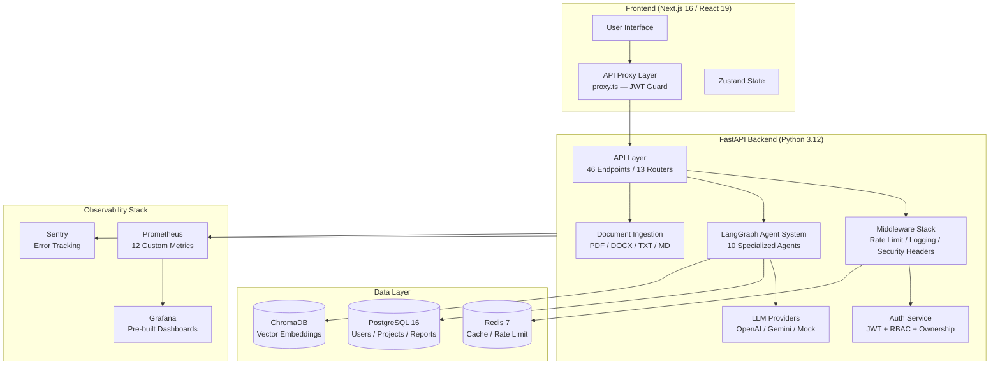
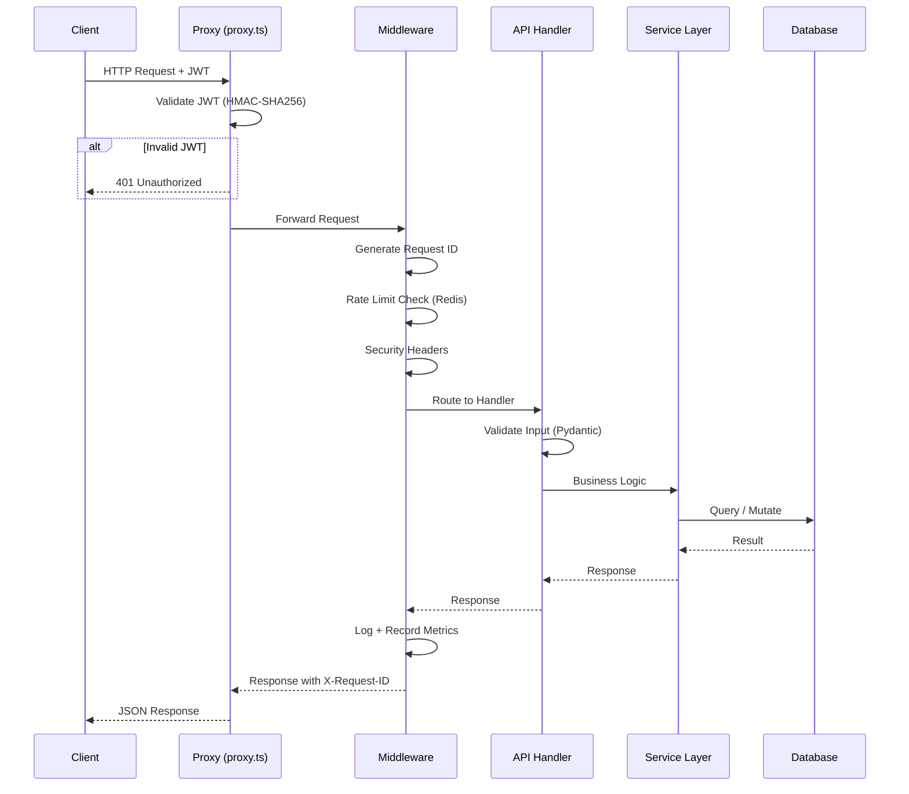

# AARA — Agentic AI Research Assistant

**A production-grade, multi-agent AI research platform that autonomously conducts literature reviews, analyzes research gaps, and generates structured reports — with transparent, evidence-backed reasoning at every step.**

[](https://www.python.org/)
[](https://fastapi.tiangolo.com/)
[](https://nextjs.org/)
[](https://www.postgresql.org/)
[](https://www.docker.com/)
[](backend/tests/)
[](docs/benchmark_results_real.md)
[](backend/app/evaluation/metrics.py)
[](docs/screenshots_verified.md)
[](.github/workflows/)
[](LICENSE.md)

---

## Table of Contents

- [Overview](#overview)
- [Architecture](#architecture)
- [Features](#features)
- [Security](#security)
- [Tech Stack](#tech-stack)
- [Project Structure](#project-structure)
- [Quick Start](#quick-start)
- [Docker Deployment](#docker-deployment)
- [API Documentation](#api-documentation)
- [Monitoring & Observability](#monitoring--observability)
- [CI/CD Pipeline](#cicd-pipeline)
- [Performance Testing](#performance-testing)
- [Repository Standards](#repository-standards)
- [Portfolio & Demo](#portfolio--demo)
- [Roadmap](#roadmap)
- [Contributing](#contributing)
- [License](#license)

---

## Overview

AARA transforms unstructured research queries into structured, evidence-grounded reports. Instead of a single Q&A model, it runs a **coordinated team of 10 specialized agents** — each with a distinct role — that work through a structured research pipeline:

```
User Query → Planner → Retriever → Summarizer → Gap Analyzer → Citation Validator → Evidence Validator → Quality Reviewer → Report Generator → Final Report
```

Each agent's output is grounded in actual sources with confidence scores, citation tracking, contradiction detection, and transparent reasoning traces.

### Engineering Philosophy

- **Production-grade security** — JWT authentication with refresh rotation, RBAC, ownership enforcement, rate limiting, upload validation, prompt injection mitigation
- **Defense-in-depth** — 4 independent auth layers (proxy, interceptor, middleware, service-level checks)
- **Resilient by default** — graceful degradation for Redis, ChromaDB, and LLM provider failures
- **Observable** — structured JSON logging, Prometheus metrics, Grafana dashboards, Sentry error tracking
- **Tested** — 507+ passing tests across unit, integration, and E2E scenarios

---

## Architecture

### System Architecture



### Request Lifecycle



---

## Features

| Category | Feature | Details |
|----------|---------|---------|
| **AI** | Multi-Agent System | 10 LangGraph agents: Planner, Retriever, Summarizer, Gap Analyzer, Report Generator, Proposal, Paper Author, Citation Validator, Evidence Validator, Quality Reviewer |
| **AI** | Research Planning | Agent analyzes query, generates structured plan with subtopics and search queries |
| **AI** | RAG Pipeline | Semantic search across ChromaDB vector store with re-ranking and deduplication |
| **AI** | Gap Analysis | Identifies 5-10 research gaps with severity ratings, confidence scores, and remediation |
| **AI** | Report Generation | Publication-quality reports with citations, contradictions, and executive summary |
| **AI** | LLM-Enhanced Reports | Abstractive summarization and report section generation via configurable LLM providers |
| **AI** | Citation Tracking | Evidence-grounded citations with source verification |
| **AI** | Hallucination Detection | Linguistic pattern analysis + citation-support overlap scoring |
| **AI** | Benchmark Suite | 13 real Gemini queries + 6 template fallback, 8 quality metrics, 100% completion |
| **AI** | Demo Dataset | 10 polished showcase projects with seed report data |
| **AI** | Google Gemini | Dual model support: 2.0 Flash (1,500 req/day) + 2.5 Flash (20 req/day) |
| **AI** | Pluggable LLMs | OpenAI GPT-4o, Google Gemini, Mock provider (configurable) |
| **Security** | JWT Authentication | HMAC-SHA256, configurable expiry, refresh token rotation, token versioning |
| **Security** | RBAC Authorization | Admin, Researcher, Viewer roles — enforced at every endpoint |
| **Security** | Ownership Enforcement | Resource-level access control on 20+ endpoints |
| **Security** | Rate Limiting | Redis-backed sliding window with atomic Lua scripts (TOCTOU-free) |
| **Security** | Upload Validation | File size limit (10MB), filename sanitization, extension whitelist |
| **Security** | Security Headers | HSTS, CSP, X-Frame-Options, X-Content-Type-Options, Permissions-Policy |
| **Security** | Prompt Injection Mitigation | Instruction delimiters, system-level guards |
| **Security** | Password Security | bcrypt hashing, complexity validation, account lockout |
| **DevOps** | Docker | Multi-stage builds (200MB image), non-root user, health checks |
| **DevOps** | GitHub Actions | 6 workflows: PR checks, main branch, security scan, load test, deploy staging, release |
| **DevOps** | k6 Load Testing | 5 scenarios: smoke, average (50 users), stress (300), spike (500), endurance |
| **DevOps** | Monitoring | Prometheus + Grafana + Sentry with pre-built dashboards |
| **DevOps** | Health Checks | /health, /ready, /live endpoints for orchestration |

---

## Security

### Defense-in-Depth Architecture

```
Layer 1: proxy.ts (Edge)
├── Reads JWT from auth_token cookie
├── Verifies HMAC-SHA256 signature
├── Validates exp claim and sub claim
└── Redirects to login if invalid

Layer 2: API Client Interceptor (Browser)
├── Attaches Bearer token to every request
├── Detects 401 responses
├── Silent token refresh via /auth/refresh
├── Queues concurrent 401s (single refresh for N requests)
└── Redirects to login only if refresh fails

Layer 3: FastAPI Middleware (Backend)
├── Rate limiting with Redis (Lua scripting, TOCTOU-free)
├── Security headers (HSTS, CSP, XFO)
├── Structured JSON logging with request/correlation IDs
└── Global exception handlers

Layer 4: Service Layer (Backend)
├── JWT decode + signature verification
├── Token type check (access vs refresh)
├── Token version check (global invalidation)
├── RBAC enforcement (require_role)
└── Ownership verification (require_ownership)
```

### Security Audit

A comprehensive security audit (10 phases) has been completed:

- **Authorization audit** — all endpoints checked; 2 missing auth fixed
- **Database integrity** — ChromaDB filter bug fixed, COUNT query optimized
- **Security posture** — no hardcoded secrets, JWT implementation verified
- **Upload security** — size limits, sanitization, extension validation
- **Rate limiting** — atomic Lua scripting, TOCTOU race condition fixed
- **AI safety** — prompt injection mitigation, citation verification added
- **Full report**: [docs/BACKEND_AUDIT_REPORT.md](docs/BACKEND_AUDIT_REPORT.md)

---

## Tech Stack

### Backend

| Technology | Purpose |
|------------|---------|
| Python 3.12 | Runtime |
| FastAPI 0.115 | REST framework with async support |
| SQLAlchemy 2.0 | Async ORM with PostgreSQL 16 |
| Pydantic v2 | Request/response validation |
| Alembic | Database migrations (7 versions) |
| LangGraph | Agent workflow orchestration |
| ChromaDB | Vector similarity search |
| Redis 7 | Rate limiting and cache |
| Dramatiq | Background task queue |
| pytest | 507+ tests (15 files) |

### Frontend

| Technology | Purpose |
|------------|---------|
| Next.js 16 | App Router, Server Components |
| React 19 | UI components, Suspense |
| TypeScript 5.7 | Type safety across codebase |
| Tailwind CSS v4 | Utility-first styling |
| Zustand | Global state management |
| Axios | HTTP client with token refresh |
| Framer Motion | Page transitions |

### Infrastructure

| Technology | Purpose |
|------------|---------|
| Docker | Multi-stage builds, 200MB image |
| Docker Compose | Dev (3 services) + Staging (7 services) |
| GitHub Actions | CI/CD with lint, test, security, deploy |
| Prometheus | Metrics collection (12 custom metrics) |
| Grafana | Dashboards (pre-built) |
| Sentry | Error tracking |
| k6 | Load testing (5 scenarios) |

---

## Project Structure

```
aara/
├── .github/                         # GitHub standards
│   ├── workflows/                   # CI/CD pipelines (6 workflows)
│   ├── ISSUE_TEMPLATE/              # Bug, feature, security templates
│   ├── PULL_REQUEST_TEMPLATE.md     # PR checklist
│   ├── CODEOWNERS                   # Ownership assignments
│   └── dependabot.yml              # Automated dependency updates
│
├── backend/                         # FastAPI backend
│   ├── app/                         # Application code
│   │   ├── agents/                  # 10 specialized agents + utilities
│   │   ├── analysis/                # Research Analysis Engine (Phase 2.5)
│   │   ├── api/                     # 62 endpoints across 15 routers
│   │   ├── cache/                   # Caching layer
│   │   ├── core/                    # Config, security, logging, observability
│   │   ├── db/                      # Database session management
│   │   ├── evaluation/              # Benchmark framework (20 questions, 8 metrics)
│   │   │   ├── metrics.py           # QA metrics: coverage, density, hallucination
│   │   │   ├── scorecard.py         # Weighted composite scoring
│   │   │   ├── benchmark.py         # Gold-standard benchmark runner
│   │   │   ├── benchmark_scenarios.py  # 5 scenario definitions
│   │   │   ├── benchmark_20_questions.py # 20-question suite (7 categories)
│   │   │   ├── evaluators.py        # Workflow evaluation + trend analysis
│   │   │   └── report.py            # Evaluation report formatting
│   │   ├── experiments/             # Experiment Planning Engine (Phase 2.7)
│   │   ├── graphs/                  # Workflow orchestration
│   │   ├── ingestion/               # Document processing pipeline
│   │   ├── knowledge_graph/         # Knowledge Graph Engine (Phase 2.8)
│   │   ├── llm/                     # LLM providers (OpenAI, Gemini, Mock)
│   │   ├── methodology/             # Research Methodology Engine (Phase 2.6)
│   │   ├── middleware/              # Rate limiting, security headers, logging
│   │   ├── models/                  # 10 SQLAlchemy ORM models
│   │   ├── planner/                 # Research Planner subsystem (Phase 2.3)
│   │   ├── rag/                     # RAG Core + Advanced Retrieval (Phase 2.1-2.2)
│   │   ├── redis/                   # Redis client utilities
│   │   ├── schemas/                 # Pydantic request/response schemas
│   │   ├── seed_data/               # Demo project data (10 showcase projects)
│   │   ├── services/                # Business logic layer
│   │   ├── summarization/           # Research Summarization Engine (Phase 2.4)
│   │   ├── tasks/                   # Background task definitions
│   │   ├── utils/                   # Shared utility functions
│   │   ├── vectorstore/             # ChromaDB vector store integration
│   │   ├── workers/                 # Background worker processes
│   │   └── main.py                  # App factory with lifespan validation
│   ├── tests/                       # 507+ tests across 15 files
│   ├── monitoring/                  # Prometheus + Grafana config
│   ├── audit_reports/               # 10-phase security audit
│   ├── Dockerfile                   # Multi-stage build
│   ├── docker-compose.yml           # Development stack
│   └── docker-compose.staging.yml   # Staging stack with monitoring
│
├── load-testing/                    # k6 performance testing
│   ├── smoke.js                     # Basic functionality verification
│   ├── average-load.js              # 50 concurrent users
│   ├── stress-test.js               # Escalating to 300+ users
│   ├── spike-test.js                # Sudden traffic to 500 users
│   ├── endurance-test.js            # 60-minute sustained load
│   ├── performance_baseline.md      # Baseline metrics template
│   └── README.md                    # Load testing documentation
│
├── deployment/                      # Production deployment docs
│   └── README.md                    # Deployment guide
│
├── docs/                            # Documentation
│   ├── architecture/                # System architecture (Mermaid diagrams)
│   └── portfolio/                   # Demo scripts, resume bullets, interview prep
│
├── app/                             # Next.js frontend
├── components/                      # Reusable React components
├── lib/                             # Shared utilities
├── proxy.ts                         # Edge JWT validation
│
├── README.md                        # This file
├── CHANGELOG.md                     # Release history
├── CONTRIBUTING.md                  # Contribution guide
├── SECURITY.md                      # Security policy
└── LICENSE.md                       # MIT license
```

---

## Quick Start

### Prerequisites

- Python 3.12+
- Node.js 20+
- Docker & Docker Compose

### Backend

```bash
cd backend

# Virtual environment
python -m venv .venv
source .venv/bin/activate  # Linux/Mac
# .venv\Scripts\Activate.ps1  # Windows

# Install dependencies
pip install -r requirements.txt

# Configure environment
cp .env.example .env
# Edit .env — set SECRET_KEY to a secure random string (min 32 chars)

# Start PostgreSQL
docker compose up -d db

# Run migrations
alembic upgrade head

# Start the API
uvicorn app.main:app --reload --port 8000
```

### Frontend

```bash
# From project root
npm install
npm run dev
```

### Verify

- API: http://localhost:8000/docs
- Health: http://localhost:8000/health
- Frontend: http://localhost:3000

---

## Docker Deployment

### Development Stack

```bash
cd backend
docker compose up --build
```

Starts: PostgreSQL 16, ChromaDB, FastAPI (with auto-migration)

### Staging Stack (with Monitoring)

```bash
cd backend
docker compose -f docker-compose.staging.yml up -d
```

Additional: Redis 7, Dramatiq workers (2 replicas), Prometheus, Grafana

### Production Checklist

- [ ] `SECRET_KEY` set to cryptographically random 64-char string
- [ ] `DATABASE_URL` uses production PostgreSQL credentials
- [ ] `REDIS_URL` configured for production Redis
- [ ] HTTPS termination at reverse proxy / load balancer
- [ ] `ENV=production`
- [ ] Monitoring stack deployed
- [ ] Sentry DSN configured
- [ ] Database backup strategy in place

**Full deployment guide**: [deployment/README.md](deployment/README.md)

---

## API Documentation

62 REST endpoints across 15 routers. Full OpenAPI spec at `/docs` or `/redoc`.

### Authentication

| Method | Endpoint | Description |
|--------|----------|-------------|
| POST | `/auth/register` | Register new user |
| POST | `/auth/login` | Login (returns access + refresh tokens) |
| POST | `/auth/refresh` | Rotate token pair |
| GET | `/auth/me` | Current user profile |

### Projects

| Method | Endpoint | Auth | Description |
|--------|----------|------|-------------|
| GET | `/projects` | JWT | List user's projects |
| POST | `/projects` | JWT | Create project |
| GET | `/projects/{id}` | JWT+Owner | Get project |
| PUT | `/projects/{id}` | JWT+Owner | Update project |
| DELETE | `/projects/{id}` | JWT+Admin | Delete project |

### Agents & Research

| Method | Endpoint | Auth | Description |
|--------|----------|------|-------------|
| POST | `/agents/run` | JWT+Owner | Execute research workflow |
| GET | `/agents/registry` | JWT+Admin | List registered agents |
| GET | `/agents/health` | JWT | Agent system status |

### Documents & Retrieval

| Method | Endpoint | Auth | Description |
|--------|----------|------|-------------|
| POST | `/documents/upload` | JWT+Owner | Upload document (PDF/DOCX/TXT/MD) |
| GET | `/documents` | JWT+Owner | List documents |
| DELETE | `/documents/{id}` | JWT+Owner | Delete document |
| POST | `/retrieval/search` | JWT | Semantic search |
| POST | `/retrieval/context` | JWT | Multi-collection context retrieval |

### Reports

| Method | Endpoint | Auth | Description |
|--------|----------|------|-------------|
| POST | `/reports/generate` | JWT | Generate report |
| POST | `/reports/preview` | JWT | Preview report |
| POST | `/reports/export` | JWT | Export report (MD/JSON/HTML/PDF/DOCX) |

### Monitoring

| Method | Endpoint | Description |
|--------|----------|-------------|
| GET | `/health` | Detailed health check (DB, Redis, uptime) |
| GET | `/ready` | Readiness probe |
| GET | `/live` | Liveness probe |
| GET | `/metrics` | Prometheus metrics |

---

## Monitoring & Observability

### Health Endpoints

| Endpoint | Purpose | Response |
|----------|---------|----------|
| `GET /health` | Detailed service health | `{"status": "healthy", "services": {...}}` |
| `GET /ready` | Readiness for orchestration | `{"status": "ready", "checks": {...}}` |
| `GET /live` | Process liveness | `{"status": "alive"}` |

### Metrics (Prometheus)

12 custom metrics exposed at `GET /metrics`:

- `http_requests_total` — Request count by method/path/status
- `http_request_duration_seconds` — Latency histogram (p50/p95/p99)
- `errors_total` — Errors by type and service
- `auth_failures_total` — Authentication failures by reason
- `rate_limit_violations_total` — Rate limit hits
- `workflow_duration_seconds` — LangGraph workflow duration
- `agent_duration_seconds` — Per-agent execution time
- `llm_request_duration_seconds` — LLM provider latency
- `db_query_duration_seconds` — Database query latency
- `active_workflows` — Concurrent workflow gauge
- `queue_depth` — Dramatiq queue depth

### Logging

Structured JSON logging with:

- **Request ID** — unique UUID per request
- **Correlation ID** — end-to-end trace (propagated from client headers)
- **User ID** — authenticated user context
- **Execution time** — per-request latency
- **Error context** — structured error details

**Logging architecture**: [backend/app/core/logging_architecture.md](backend/app/core/logging_architecture.md)

### Dashboards

Pre-built Grafana dashboards in `backend/monitoring/grafana/dashboards/`:
- **AARA Overview** — system health, request rate, latency, error rate
- **AARA Alerts** — alerting dashboard with threshold violations

**Monitoring guide**: [backend/monitoring/README.md](backend/monitoring/README.md)

---

## CI/CD Pipeline

6 GitHub Actions workflows:

### PR Checks (`pr-checks.yml`)
Triggered on pull requests to `main`/`develop`:
- **Lint**: ruff linter + formatter check
- **Type check**: mypy with strict config
- **Tests**: pytest with PostgreSQL service container
- **Security**: bandit static analysis + pip-audit + safety

### Main Branch (`main-branch.yml`)
Triggered on push to `main`:
- **Full test suite**: pytest with JUnit XML output
- **Docker build**: multi-stage build verification + health check test
- **Lint + format + type check**

### Security Scan (`security-scan.yml`)
Triggered weekly and on push:
- **Dependency audit**: pip-audit, safety
- **Secret scanning**: TruffleHog
- **CodeQL analysis**: Python + JavaScript
- **Docker scan**: Trivy for CVE detection

### Load Test (`load-test.yml`)
Manual trigger via workflow_dispatch:
- Runs k6 scenarios against target URL
- Supports smoke, average-load, stress-test, spike-test, endurance-test

### Deploy Staging (`deploy-staging.yml`)
Triggered via release workflow:
- Deploys to staging environment with full monitoring stack
- Docker Compose with PostgreSQL, ChromaDB, Redis, Dramatiq workers

### Release (`release.yml`)
Manual trigger with version validation:
- Validates semver format (major.minor.patch)
- Builds frontend + backend Docker images
- Publishes GitHub Release with auto-generated notes

---

## Performance Testing

k6 framework covering 5 scenarios:

| Scenario | Users | Duration | Goal |
|----------|-------|----------|------|
| Smoke | 1 | 30s | Verify basic functionality |
| Average Load | 50 | 6m | Simulate typical traffic |
| Stress Test | 300 | 10m | Find breaking point |
| Spike Test | 500 | 2m | Test traffic surge handling |
| Endurance | 30 | 70m | Detect memory leaks |

```bash
k6 run load-testing/smoke.js
k6 run load-testing/average-load.js
k6 run load-testing/stress-test.js
```

**Full documentation**: [load-testing/README.md](load-testing/README.md)

---

## Screenshots

| Page | Preview |
|------|---------|
| Landing Page |  |
| Login |  |
| Dashboard |  |
| New Research |  |
| Papers View |  |
| Literature Review |  |
| Gap Analysis |  |
| Novel Directions |  |
| Report Generation |  |
| Citation Manager |  |
| Agent Monitoring |  |
| Settings |  |

Full screenshot verification: [screenshots_verified.md](docs/screenshots_verified.md)

---

## Repository Standards

- **Issue templates**: Bug report, feature request, security report
- **PR template**: Checklist for tests, linting, security, documentation
- **CODEOWNERS**: Team-based ownership by area (backend, frontend, infra, AI, security)
- **Dependabot**: Weekly updates for pip, npm, and GitHub Actions
- **Security policy**: [SECURITY.md](SECURITY.md)

---

## Portfolio & Demo

Assets for internship/new-grad applications:

| Asset | Description |
|-------|-------------|
| [2-Minute Demo Script](docs/portfolio/demo_script_2min.md) | Recruiter-friendly project overview |
| [5-Minute Technical Demo](docs/portfolio/demo_technical_5min.md) | Deep dive into architecture and implementation |
| [Interview Talking Points](docs/portfolio/interview_talking_points.md) | STAR format answers, key challenges, technical highlights |
| [Resume Bullets](docs/portfolio/resume_bullets.md) | Action-oriented bullet points for each domain |
| [LinkedIn Description](docs/portfolio/linkedin_description.md) | Project description for LinkedIn profile |
| [Benchmark Suite](backend/app/evaluation/benchmark_20_questions.py) | 20 research questions across 7 categories with gold-standard answers |
| [Evaluation Framework](backend/app/evaluation/metrics.py) | 8 quality metrics with weighted composite scoring |
| [Demo Project Data](backend/app/seed_data/demo_projects.py) | 10 polished showcase projects for public demo |

---

## Roadmap

### Short-term
- [x] Security audit (10 phases completed)
- [x] Structured logging with correlation IDs
- [x] k6 load testing framework
- [x] GitHub Actions CI/CD
- [x] GitHub issue/PR templates
- [x] Production Dockerfile (multi-stage, non-root)
- [x] Health check endpoints (/health, /ready, /live)
- [x] Architecture documentation (Mermaid diagrams)
- [x] Evaluation framework (8 quality metrics, weighted composite)
- [x] 20-question benchmark suite (7 categories, 3 difficulty levels)
- [x] LLM-enhanced report generation (abstractive summarization)
- [x] Hallucination detection (pattern analysis + citation overlap)
- [x] Demo dataset (10 showcase projects with seed data)
- [ ] PDF export for reports
- [ ] Multi-agent collaboration (agents critique each other's outputs)

### Medium-term
- [x] Knowledge graphs from extracted entities (Phase 2.8)
- [x] Long-term memory across research sessions (Phase 1)
- [ ] Collaborative workspaces
- [ ] Zotero/Mendeley integration
- [ ] Terraform infrastructure-as-code

### Long-term
- [ ] Enterprise SSO (SAML/OIDC)
- [ ] Audit trail for compliance
- [ ] Deployment to AWS/GCP with ECS/EKS
- [ ] Real-time WebSocket agent streaming

---

## Contributing

See [CONTRIBUTING.md](CONTRIBUTING.md) for the full contribution guide.

- Open an issue to discuss major changes
- Maintain test coverage — run `pytest` before submitting
- Follow existing code style (ruff for Python, Prettier for frontend)
- Use the PR template for all submissions

---

## License

MIT — see [LICENSE.md](LICENSE.md).

---

*Built with FastAPI, Next.js, LangGraph, and a lot of curiosity about what happens when you let AI agents plan their own research.*
