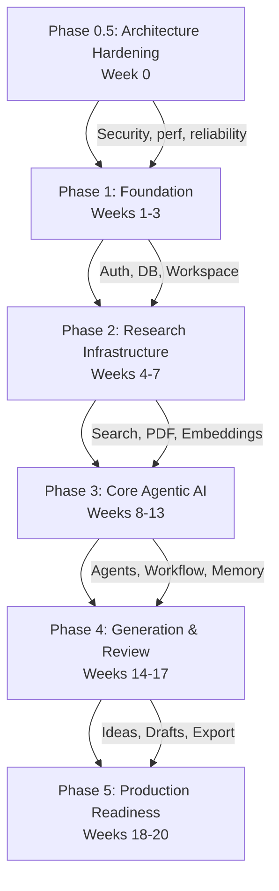

# Document 01 — Implementation Roadmap

## Overview

The Implementation Roadmap defines the sequential delivery plan for AARA across 5 phases. Each phase builds on the previous, with clear dependencies and acceptance criteria. The roadmap balances academic semester constraints (15-16 weeks) with production-grade deliverables.

## Phase Dependency Graph

## Phase 0.5 — Architecture Hardening (1 week)

**Objective**: Apply security, performance, and reliability improvements identified in Principal Engineer review before implementation begins.

| Week | Deliverables | Dependencies |
|---|---|---|
| 0 | LLM Security Layer (input guard, prompt isolation, RAG protection, output guard), Cached JWKS verification, Batch embedding pipeline, Qdrant payload indexes | None |

**Acceptance Criteria**:
- [ ] Regex-based prompt injection removed; replaced with defense-in-depth pipeline
- [ ] RAG Protection Layer sanitizes all retrieved content before agent context
- [ ] JWT verification uses cached JWKS (no Supabase API call per request)
- [ ] Embedding pipeline uses `embed_batch` (not per-chunk loop)
- [ ] Qdrant collections created with payload indexes on `workspace_id`, `paper_id`, `model_id`
- [ ] Workflow idempotency key enforced at API level
- [ ] Event Bus handlers execute asynchronously (non-blocking)
- [ ] Evaluation Framework and Cost Intelligence designs documented

## Phase 1 — Foundation (3 weeks)

**Objective**: Establish project foundation — authentication, database, workspace management, and dashboard.

| Week | Deliverables | Dependencies |
|---|---|---|
| 1 | Project scaffold (Next.js, FastAPI, Docker Compose), Supabase Auth, Login/Register UI | None |
| 2 | Database schema + migrations, Workspace CRUD API + UI | Week 1 |
| 3 | Dashboard, workspace detail layout, profile page, API client layer | Week 2 |

**Acceptance Criteria**:
- [ ] User can sign up and log in (email + Google OAuth)
- [ ] User can create, view, edit, delete workspaces
- [ ] Dashboard displays workspace list with metadata
- [ ] Dark/light mode functional
- [ ] JWT auto-refresh works
- [ ] RLS prevents cross-user data access
- [ ] Backend health endpoint responds
- [ ] Docker Compose brings up all services

**Key Risk**: Supabase free tier limits (500MB DB, 50K users). Mitigation: Compress JSONB fields, paginate API responses.

## Phase 2 — Research Infrastructure (4 weeks)

**Objective**: Enable paper discovery, ingestion, and semantic search.

| Week | Deliverables | Dependencies |
|---|---|---|
| 4 | Research API clients (Semantic Scholar, arXiv, Crossref), DeduplicationService, Paper import API | Phase 1 |
| 5 | PDF pipeline stages 1-8 (upload → validation → type detection → OCR → layout → sections → tables → refs) | Week 4 |
| 6 | PDF pipeline stages 9-16 (chunking → embedding → Qdrant → metadata storage), Embedding provider interface | Week 5 |
| 7 | Semantic search API, Paper library UI, Cost Control cache + token tracking | Week 6 |

**Acceptance Criteria**:
- [ ] Search across ≥3 research APIs returns deduplicated, ranked results
- [ ] PDF upload extracts text, metadata, references (graceful on scanned PDFs)
- [ ] Papers are embeddable via Sentence Transformers
- [ ] Semantic search returns relevant results in <500ms
- [ ] Embedding model versioning works (collection-per-model)
- [ ] Cost Control caches responses, tracks tokens

**Key Risk**: PDF quality variance. Mitigation: Graceful degradation per pipeline stage; user sees per-stage success flags.

## Phase 3 — Core Agentic AI (6 weeks)

**Objective**: Implement the first 4 agents (Supervisor, Planner, Research, Analysis) with full ReAct lifecycle.

| Week | Deliverables | Dependencies |
|---|---|---|
| 8 | BaseAgent class, Event Bus, Tool Router + Registry, WebSocket streaming | Phase 2 |
| 9 | Supervisor Agent, Planning Agent, Workflow Engine (sequential executor + state manager) | Week 8 |
| 10 | Research Agent (full ReAct, tool usage, dedup integration) | Week 9 |
| 11 | Analysis Agent (theme extraction, gap analysis, comparison tables) | Week 10 |
| 12 | Human-in-the-loop checkpoints, Approval UI, Workflow state persistence | Week 11 |
| 13 | Agent execution UI (live view, progress, logs), Integration tests | Week 12 |

**Acceptance Criteria**:
- [ ] All 4 agents execute with ReAct lifecycle (Plan → Reason → Tool → Observe → Reflect → Validate)
- [ ] Workflow engine runs sequentially with PostgreSQL-persisted state
- [ ] WebSocket streams agent events to frontend (SSE fallback works)
- [ ] Human-in-the-loop pauses/resumes workflows
- [ ] Literature review generated with themes, gaps, comparison tables
- [ ] Tool Router caches responses, retries failures, collects metrics
- [ ] Agent execution logs persist with full traceability

**Key Risk**: Context window overflow on long ReAct loops. Mitigation: Prompt engineering (concise outputs, structured schemas, early stopping when answer found).

## Phase 4 — Generation & Review (4 weeks)

**Objective**: Implement remaining 3 agents (Idea Generation, Writing, Review) and export pipeline.

| Week | Deliverables | Dependencies |
|---|---|---|
| 14 | Idea Generation Agent, Research Overlap Analysis service | Phase 3 |
| 15 | Writing Agent (structured draft generation with inline citations) | Week 14 |
| 16 | Review Agent (citation validation, quality checking), Evaluation Engine (objective metrics) | Week 15 |
| 17 | Export Service (PDF, MD, DOCX, LaTeX, BibTeX), Template system (IEEE, ACM, Springer), Idea/Draft/Review UI | Week 16 |

**Acceptance Criteria**:
- [ ] Idea Generation produces structured proposals with overlap scores
- [ ] Writing Agent generates sectioned draft with inline citations
- [ ] Review Agent validates citations (DOI lookup) and quality-checks
- [ ] Export works for PDF, Markdown, DOCX, LaTeX, BibTeX
- [ ] IEEE, ACM, Springer template formatting available
- [ ] Evaluation Engine collects objective metrics per workflow
- [ ] Full workflow (search → analysis → ideas → draft → review → export) completes

**Key Risk**: Draft quality varies by topic. Mitigation: Review Agent catches structure/completeness issues; user must approve at each checkpoint.

## Phase 5 — Production Readiness (3 weeks)

**Objective**: Harden for production — security, testing, monitoring, deployment.

| Week | Deliverables | Dependencies |
|---|---|---|
| 18 | Rate limiting, Security audit (OWASP, prompt injection, XSS), Volume testing | Phase 4 |
| 19 | Performance optimization, Observability dashboards (cost, latency, agent metrics) | Week 18 |
| 20 | CI/CD pipeline, Monitoring/alerts, Documentation (setup + user guides), Final E2E tests | Week 19 |

**Acceptance Criteria**:
- [ ] Rate limiting prevents abuse (per-user, per-endpoint, per-provider)
- [ ] OWASP Top 10 reviewed; prompt injection protection implemented
- [ ] CI/CD pipeline deploys frontend + backend + worker to Railway
- [ ] Cost dashboard shows per-workflow and per-user spend
- [ ] Error rate <5% across all workflows
- [ ] All unit/integration/API/E2E tests pass
- [ ] Setup guide + user guide complete

**Key Risk**: Railway free tier limitations (500MB RAM, $5 credit). Mitigation: Optimize container sizes, use SQLite for dev, Redis Cloud free tier (30MB).

## Total Timeline

| Phase | Duration | Hours/Week | Total Hours |
|---|---|---|---|---|
| 0.5 — Architecture Hardening | 1 week | 10-15 | 10-15 |
| 1 — Foundation | 3 weeks | 15-20 | 45-60 |
| 2 — Research Infrastructure | 4 weeks | 15-20 | 60-80 |
| 3 — Core Agentic AI | 6 weeks | 15-20 | 90-120 |
| 4 — Generation & Review | 4 weeks | 15-20 | 60-80 |
| 5 — Production Readiness | 3 weeks | 10-15 | 30-45 |
| **Buffer** | **2 weeks** | — | — |
| **Total** | **23 weeks** | | **295-400 hours** |

Full-time equivalent (40hrs/week): ~10-12 weeks.

**Note**: Phase 0.5 (Architecture Hardening) is a documentation and design phase that must be completed before any code is written. It does not increase the total implementation timeline — it formalizes security and performance improvements that would otherwise be discovered during Phase 2-3.
