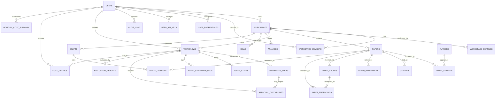

# Document 05 — ER Diagram

## Entity Summary

| Entity | Type | Description |
|---|---|---|
| users | Core | User accounts synced with Supabase Auth |
| workspaces | Core | Research topic containers |
| workspace_members | Join | User-workspace membership with role |
| workspace_settings | Extension | Per-workspace configuration |
| papers | Core | Research papers (imported or uploaded) |
| authors | Core | Paper authors (deduplicated globally) |
| paper_authors | Join | Paper-author relationship with ordering |
| citations | Detail | Papers cited BY a paper |
| paper_references | Detail | References contained IN a paper |
| paper_chunks | Detail | Text chunks for embedding |
| paper_embeddings | Detail | Vector embeddings (per model) |
| workflows | Core | Research workflow executions |
| workflow_steps | Detail | Individual agent steps in a workflow |
| agent_states | Detail | Per-agent ReAct state persistence for crash recovery |
| agent_execution_logs | Audit | Per-agent execution telemetry |
| approval_checkpoints | Detail | Human-in-the-loop pause points |
| analyses | Detail | Generated analysis reports |
| ideas | Detail | Generated research ideas |
| drafts | Core | Generated paper drafts |
| draft_citations | Detail | Citations within a draft |
| evaluation_reports | Detail | Quality evaluation metrics |
| audit_logs | Audit | Security and action audit trail |
| user_preferences | Extension | User-level settings |
| user_api_keys | Detail | Encrypted LLM provider API keys |
| global_memory | Detail | Cross-workspace persistent memory |
| cost_metrics | Detail | Per-workflow cost and usage telemetry |
| monthly_cost_summary | Summary | Monthly cost aggregation per user |
