# Document 09 — PDF Processing Pipeline

## Pipeline Architecture

```mermaid
graph LR
    Upload[PDF Upload] --> Scan[Virus Scan]
    Scan --> Validate[Validation]
    Validate --> TypeDetect[Type Detection]
    TypeDetect --> OCR[OCR]
    OCR --> Layout[Layout Detection]
    Layout --> Section[Section Detection]
    Section --> Tables[Table Extraction]
    Tables --> Figures[Figure Extraction]
    Figures --> Equations[Equation Detection]
    Equations --> Refs[Reference Extraction]
    Refs --> Metadata[Metadata Extraction]
    Metadata --> Chunk[Chunking]
    Chunk --> Embed[Embedding]
    Embed --> Qdrant[Qdrant Storage]
    Embed --> PG[PostgreSQL Storage]

    style Equations stroke-dasharray: 5 5
    style Equations stroke: #ff9900
```



## Stage Definitions

### Stage 1: Virus Scan
```python
class VirusScanStage(PipelineStage):
    """Scan uploaded PDF for malware using ClamAV (optional)."""
    is_required: bool = False

    async def process(self, ctx: PipelineContext) -> PipelineContext:
        result = await run_clamav(ctx.file_path)
        if result.infected:
            raise PipelineError(f"File infected: {result.virus_name}")
        ctx.stage_results["virus_scan"] = {"clean": True}
        return ctx
```

### Stage 2: Validation
```python
class ValidationStage(PipelineStage):
    """Validate file is a valid PDF, check size limits."""
    is_required: bool = True
    max_size_mb: int = 50

    async def process(self, ctx: PipelineContext) -> PipelineContext:
        if ctx.file_size > self.max_size_mb * 1024 * 1024:
            raise PipelineError(f"File exceeds {self.max_size_mb}MB limit")

        with open(ctx.file_path, "rb") as f:
            header = f.read(5)
            if header != b"%PDF-":
                raise PipelineError("Not a valid PDF file")

        doc = fitz.open(ctx.file_path)
        if doc.is_encrypted:
            raise PipelineError("Encrypted PDF not supported")

        ctx.stage_results["validation"] = {"page_count": doc.page_count}
        return ctx
```

### Stage 3: Type Detection
```python
class TypeDetectionStage(PipelineStage):
    """Detect PDF type: born-digital vs. scanned vs. hybrid."""

    async def process(self, ctx: PipelineContext) -> PipelineContext:
        doc = fitz.open(ctx.file_path)
        text_pages = sum(1 for page in doc if len(page.get_text().strip()) > 100)
        text_ratio = text_pages / doc.page_count

        if text_ratio > 0.8:
            pdf_type = "born_digital"
        elif text_ratio > 0.3:
            pdf_type = "hybrid"
        else:
            pdf_type = "scanned"

        ctx.stage_results["type_detection"] = {"pdf_type": pdf_type}
        ctx.pdf_type = pdf_type
        return ctx
```

### Stage 4: OCR (Conditional)
```python
class OCRStage(PipelineStage):
    """Run OCR on scanned pages. Only activates for scanned/hybrid PDFs."""
    is_required: bool = False

    async def process(self, ctx: PipelineContext) -> PipelineContext:
        if ctx.pdf_type == "born_digital":
            ctx.stage_results["ocr"] = {"skipped": "born_digital"}
            return ctx

        doc = fitz.open(ctx.file_path)
        ocr_text = []
        for i, page in enumerate(doc):
            if ctx.pdf_type == "scanned" or len(page.get_text().strip()) < 100:
                pix = page.get_pixmap()
                img_path = f"/tmp/page_{i}.png"
                pix.save(img_path)
                text = pytesseract.image_to_string(img_path, lang="eng")
                ocr_text.append(text)

        ctx.ocr_text = "\n".join(ocr_text)
        ctx.stage_results["ocr"] = {"pages_ocrd": len(ocr_text)}
        return ctx
```

### Stages 5-7: Layout, Section, Table, Figure, Equation

- **Layout Detection**: Identifies 1-column, 2-column, or mixed layouts using `unstructured`
- **Section Detection**: Regex-based (abstract, introduction, related work, methodology, results, conclusion) + LLM fallback
- **Table Extraction**: `pdfplumber` + heuristic cell detection
- **Figure Extraction**: PyMuPDF image extraction with caption capture
- **Equation Detection**: `pix2tex` LaTeX-OCR — **marked as experimental**; falls back to inline text on failure

### Stage 8: Reference Extraction
```python
class ReferenceExtractionStage(PipelineStage):
    """Extract references section and parse individual citations."""

    async def process(self, ctx: PipelineContext) -> PipelineContext:
        text = ctx.full_text
        ref_patterns = [
            r"(?:References|Bibliography|REFERENCES|BIBLIOGRAPHY)[\s\n]*",
            r"REFERENCES$"
        ]
        ref_start = self._find_section(text, ref_patterns)
        if not ref_start:
            ctx.stage_results["references"] = {"status": "not_found"}
            return ctx

        ref_text = text[ref_start:]
        references = self._parse_references(ref_text)
        ctx.references = references
        ctx.stage_results["references"] = {"count": len(references), "status": "extracted"}
        return ctx

    def _parse_references(self, text: str) -> list[Reference]:
        """Handle IEEE [1], ACM [1], APA (Author, Year), Springer formats."""
        refs = []
        for line in re.split(r'\n\s*(?=\[|\(|\d+\.)', text):
            ref = self._parse_single_reference(line.strip())
            if ref:
                refs.append(ref)
        return refs
```

### Stage 9: Metadata Extraction
```python
class MetadataExtractionStage(PipelineStage):
    """Extract title, authors, abstract from PDF metadata + first page."""

    async def process(self, ctx: PipelineContext) -> PipelineContext:
        doc = fitz.open(ctx.file_path)
        metadata = doc.metadata
        first_page = doc[0].get_text()

        ctx.extracted_metadata = {
            "title": self._extract_title(first_page, metadata.get("title")),
            "authors": self._extract_authors(first_page),
            "abstract": self._extract_abstract(first_page),
            "venue": metadata.get("subject"),
            "doi": metadata.get("doi"),
        }
        return ctx
```

### Stage 10: Chunking
```python
class ChunkingStage(PipelineStage):
    """Semantic chunking with section boundary awareness."""
    chunk_size: int = 512
    chunk_overlap: int = 64

    async def process(self, ctx: PipelineContext) -> PipelineContext:
        chunks = []
        for section_name, section_text in ctx.sections.items():
            section_tokens = count_tokens(section_text)
            if section_tokens <= self.chunk_size:
                chunks.append(Chunk(text=section_text, section_name=section_name))
            else:
                sub_chunks = self._split_by_tokens(section_text, self.chunk_size, self.chunk_overlap)
                for sub in sub_chunks:
                    chunks.append(Chunk(text=sub, section_name=section_name))
        ctx.chunks = chunks
        ctx.stage_results["chunking"] = {"chunk_count": len(chunks)}
        return ctx
```

### Stage 11-12: Embedding + Storage

```python
class EmbeddingStage(PipelineStage):
    """Generate embeddings for all chunks and store in Qdrant + PostgreSQL."""

    async def process(self, ctx: PipelineContext) -> PipelineContext:
        embedder = ctx.embedding_provider
        model_id = embedder.model_id

        for chunk in ctx.chunks:
            vector = await embedder.embed(chunk.text)
            point_id = await ctx.qdrant.upsert(
                collection=f"papers_{model_id.replace('/', '_')}",
                point=PointStruct(
                    id=str(uuid4()),
                    vector=vector,
                    payload={
                        "paper_id": str(ctx.paper_id),
                        "chunk_index": chunk.chunk_index,
                        "section_name": chunk.section_name,
                        "model_id": model_id,
                    }
                )
            )
            ctx.db.add(PaperEmbedding(
                paper_id=ctx.paper_id, chunk_id=chunk.id,
                model_id=model_id, vector_id=point_id,
            ))
        await ctx.db.commit()
        return ctx
```

## Error Handling

```python
class PipelineStage(ABC):
    is_required: bool = True
    max_retries: int = 2
    retry_delay_seconds: int = 5

    async def execute_with_retry(self, ctx: PipelineContext) -> PipelineContext:
        for attempt in range(self.max_retries + 1):
            try:
                return await self.process(ctx)
            except PipelineError as e:
                if attempt < self.max_retries:
                    await asyncio.sleep(self.retry_delay_seconds * (2 ** attempt))
                    continue
                if self.is_required:
                    raise
                ctx.stage_results[self.stage_name] = {"status": "failed", "error": str(e)}
                return ctx
```
