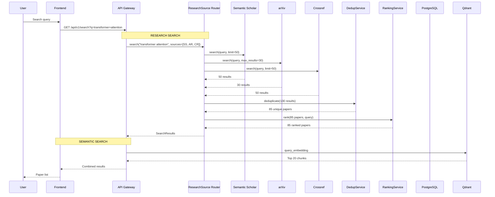

# Document 12 — Search Pipeline

## Architecture



## Search Endpoints

```
# Keyword/Metadata Search
GET /api/v1/workspaces/{workspace_id}/search?q={query}&sources={sources}
  → Returns: {papers: Paper[], total: int, source_breakdown: {ss: 50, arxiv: 30, ...}}

# Semantic Search (within workspace)
POST /api/v1/workspaces/{workspace_id}/search/semantic
  Body: {query: string, limit?: int, score_threshold?: float}
  → Returns: {results: SearchResult[], query_embedding_model: string}

# Unified Search (keyword + semantic)
GET /api/v1/workspaces/{workspace_id}/search/unified?q={query}&semantic=true
  → Returns: {keyword: SearchResult[], semantic: SearchResult[]}
```

## Re-ranking Strategy

```python
class ReRanker:
    """Cross-encoder re-ranking for improved search quality."""

    def __init__(self, use_cross_encoder: bool = True):
        self.model = CrossEncoder(
            "cross-encoder/ms-marco-MiniLM-L-6-v2"
        ) if use_cross_encoder else None

    async def re_rank(self, query: str, papers: list[Paper],
                       top_k: int = 20) -> list[Paper]:
        if not self.model or len(papers) <= top_k:
            return papers

        pairs = [(query, p.abstract or p.title) for p in papers]
        scores = await asyncio.to_thread(self.model.predict, pairs)

        scored = list(zip(papers, scores))
        scored.sort(key=lambda x: x[1], reverse=True)
        return [p for p, s in scored[:top_k]]
```

## Search Response Schema

```python
class SearchResult(BaseModel):
    paper: Paper
    score: float
    match_type: Literal["keyword", "semantic", "unified"]
    matched_field: str | None  # title, abstract, author, full_text
    chunk_snippet: str | None  # surrounding text for semantic matches
    chunk_section: str | None  # section name for semantic matches

class SearchResponse(BaseModel):
    results: list[SearchResult]
    total: int
    source_breakdown: dict[str, int]
    semantic_model: str | None
    latency_ms: int
```

## Trade-offs

| Decision | Alternative | Rationale |
|---|---|---|
| Combine keyword + semantic search | Only semantic search | Keyword search catches exact matches (titles, authors); semantic catches conceptual |
| Re-ranking via cross-encoder | Only vector search | Cross-encoder improves NDCG by 15-25% at cost of 10-20ms per 50 papers |
| Source-agnostic dedup | Per-source results kept separate | Dedup is critical for downstream analysis quality |
| Workspace-scoped search | Global search | Data isolation; users only see papers from their workspace |
