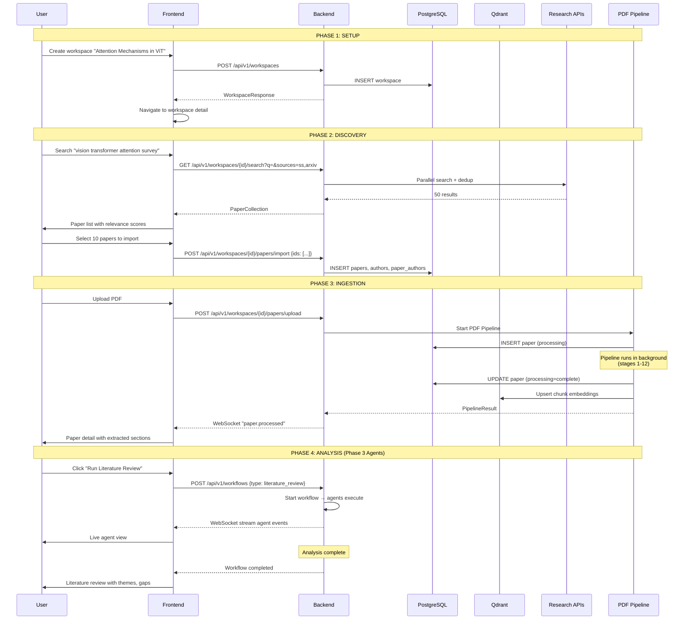
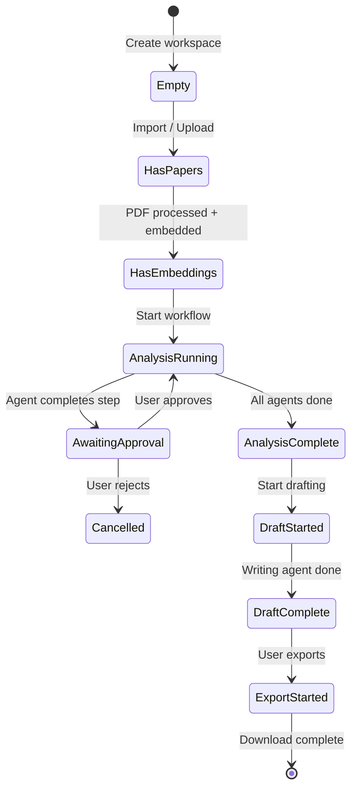

# Document 13 — Research Workspace Flow

## User Journey

## API Endpoints in Workspace Flow

| Step | Method | Endpoint | Purpose |
|---|---|---|---|
| Create workspace | POST | `/api/v1/workspaces` | Create research topic container |
| Search | GET | `/api/v1/workspaces/{id}/search` | Multi-source paper search |
| Import papers | POST | `/api/v1/workspaces/{id}/papers/import` | Import selected papers |
| Upload PDF | POST | `/api/v1/workspaces/{id}/papers/upload` | Upload PDF file |
| View papers | GET | `/api/v1/workspaces/{id}/papers` | List papers in workspace |
| View paper | GET | `/api/v1/papers/{paper_id}` | Paper detail + metadata |
| Semantic search | POST | `/api/v1/workspaces/{id}/search/semantic` | Vector search |
| Start workflow | POST | `/api/v1/workspaces/{id}/workflows` | Begin research workflow |
| Stream events | WS | `/api/v1/ws?workflow_id={id}&token={jwt}` | Real-time agent updates |

## State Transitions

