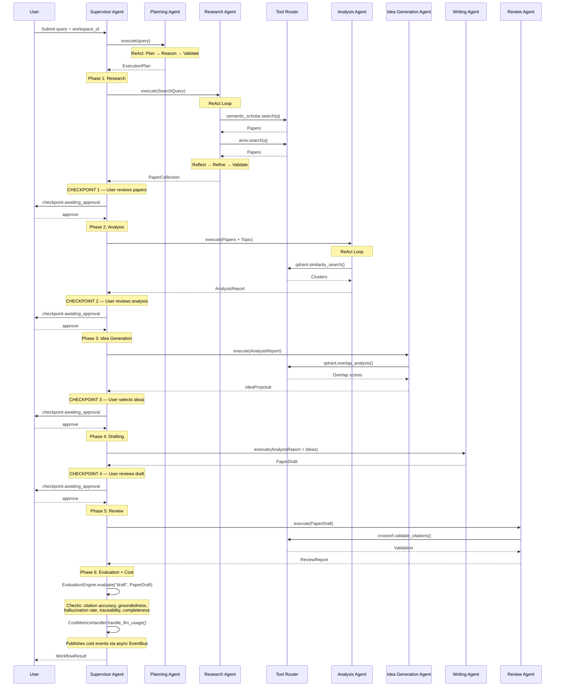
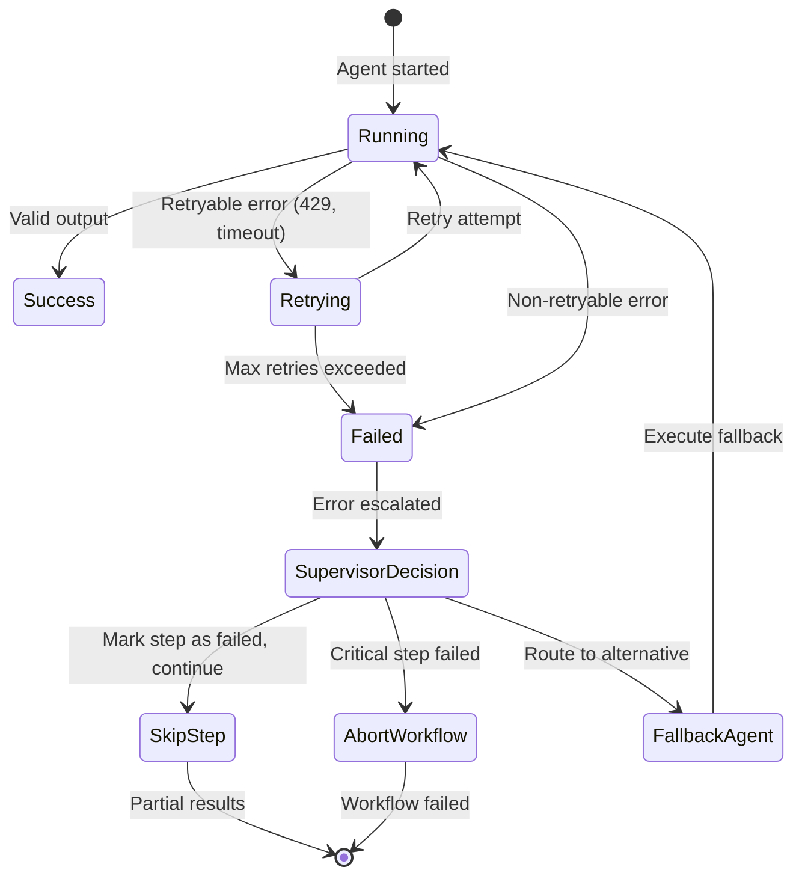

# Document 14 — Agent Interaction Diagrams

## Agent Communication Model

All agents communicate **exclusively through the Supervisor Agent**. No agent directly calls another. This ensures:
- **Loose coupling**: Replace any agent without affecting others
- **Observability**: Supervisor logs every message
- **Retry capability**: Central retry control
- **Audit trail**: Every interaction is captured

```
Supervisor
  ├──[command]──→ Planning Agent
  ├──[command]──→ Research Agent
  ├──[command]──→ Analysis Agent
  ├──[command]──→ Idea Generation Agent
  ├──[command]──→ Writing Agent
  └──[command]──→ Review Agent

Each agent ──[result]──→ Supervisor (only)
```

## Full Workflow Sequence



## Agent Message Schema

```python
class AgentMessage(BaseModel):
    message_id: str = Field(default_factory=lambda: f"msg_{uuid4().hex[:12]}")
    workflow_id: str
    source_agent: str
    target_agent: str  # "supervisor" for all result messages
    message_type: Literal["command", "result", "error", "status_update"]
    payload: dict
    timestamp: datetime = Field(default_factory=datetime.utcnow)
    trace_id: str
    correlation_id: str
```

## Agent Handoff Protocol (Supervisor Internal)

```python
class SupervisorAgent(BaseAgent):
    """Coordinates agent execution with state persistence."""

    async def execute_step(self, step: WorkflowStep) -> AgentResult:
        agent = self.agent_registry.get(step.agent_id)

        for attempt in range(agent.max_retries):
            try:
                # 1. Load input from workflow state
                input_data = await self.state_manager.get_step_input(step.id)

                # 2. Execute agent
                result = await agent.execute(AgentContext(
                    workflow_id=self.workflow_id,
                    step_id=step.id,
                    input=input_data,
                    trace_id=self.trace_id,
                ))

                # 3. Validate output
                if not await agent.validate_output(result):
                    raise ValidationError(f"Agent {step.agent_id} returned invalid output")

                # 4. Persist state
                await self.state_manager.set_step_output(step.id, result)
                await self.state_manager.persist_workflow_state(self.workflow_id)

                # 5. Emit event
                await self.event_bus.publish(AgentCompleted(
                    agent_id=step.agent_id,
                    workflow_id=self.workflow_id,
                    output_summary=result.summary(),
                    duration_ms=result.duration_ms,
                ))

                return result

            except RetryableError as e:
                if attempt < agent.max_retries - 1:
                    await asyncio.sleep(2 ** attempt)
                    await self.event_bus.publish(AgentRetrying(
                        agent_id=step.agent_id,
                        attempt=attempt + 1,
                        error=str(e),
                    ))
                    continue
                raise
```

## Parallel Execution Rules

| Agents | Parallel? | Condition |
|---|---|---|
| Planning + anything | No | Planning must complete first |
| Research + PDF processing | Yes | Independent processes |
| Analysis + PDF processing | Yes | Analysis reads from PostgreSQL where PDF is stored |
| Analysis + Idea Generation | No | Ideas depend on analysis |
| Writing + Review | No | Review depends on writing |
| Analysis + Export | No | Export needs complete results |

## Error Handling Protocol



## Agent Timeout Configuration

| Agent | Timeout (s) | Max Retries | Retry Backoff |
|---|---|---|---|
| Supervisor | 300 | 0 | N/A (delegates retries) |
| Planning | 30 | 2 | 1s, 4s |
| Research | 60 | 3 | 1s, 4s, 16s |
| Analysis | 120 | 3 | 1s, 4s, 16s |
| Idea Generation | 90 | 2 | 1s, 4s |
| Writing | 180 | 3 | 1s, 4s, 16s |
| Review | 60 | 2 | 1s, 4s |
