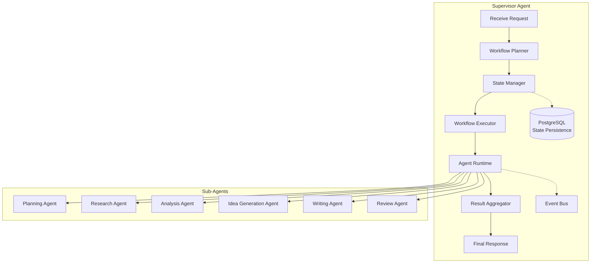
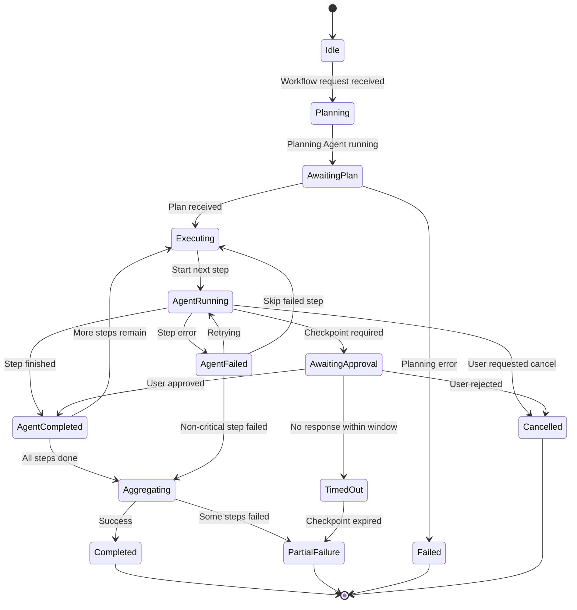

# Document 15 — Supervisor Workflow

## Supervisor Architecture



## Supervisor State Machine



## Workflow Idempotency

Every workflow execution includes an idempotency key to prevent duplicate execution from retries or double-clicks.

```python
class IdempotencyManager:
    """Ensures each workflow request is processed exactly once."""

    IDEMPOTENCY_TTL = timedelta(hours=24)  # Keys expire after 24h

    async def create_workflow(self, user_id: UUID, workspace_id: UUID,
                               query: str, idempotency_key: str) -> Workflow:
        """Create a workflow with idempotency guarantee."""

        # Check if this idempotency key was already used
        existing = await self.db.execute(
            select(Workflow).where(
                Workflow.idempotency_key == idempotency_key,
                Workflow.user_id == user_id,
            )
        )
        existing_workflow = existing.scalar_one_or_none()
        if existing_workflow:
            return existing_workflow  # Return existing, don't create duplicate

        # Create new workflow
        workflow = Workflow(
            user_id=user_id,
            workspace_id=workspace_id,
            query=query,
            idempotency_key=idempotency_key,
            status="pending",
        )
        self.db.add(workflow)
        await self.db.commit()
        return workflow

    async def cleanup_expired_keys(self):
        """Background task: remove expired idempotency keys."""
        cutoff = datetime.utcnow() - self.IDEMPOTENCY_TTL
        await self.db.execute(
            delete(Workflow).where(
                Workflow.created_at < cutoff,
                Workflow.status == "pending",  # Only clean up unused keys
            )
        )
        await self.db.commit()
```

**Idempotency key specification:**

| Property | Value | Rationale |
|---|---|---|
| Generation | Client-generated UUID v4 | Simple, no server state needed |
| Location | `Idempotency-Key` HTTP header | Standard practice (Stripe convention) |
| Storage | `workflows.idempotency_key` column (VARCHAR UNIQUE) | DB-level uniqueness guarantee |
| TTL | 24 hours | Long enough for any retry window |
| Response on duplicate | Return existing workflow (200, not 409) | Idempotent = same result, not error |

**Database schema addition:**

```sql
ALTER TABLE workflows ADD COLUMN idempotency_key VARCHAR(64) UNIQUE;
CREATE INDEX idx_workflows_idempotency ON workflows(idempotency_key, user_id);
```

## Batch State Persistence

Instead of committing to PostgreSQL after every agent step (N+1 pattern), state changes are batched and committed at natural boundaries.

```python
class BatchedStateManager:
    """Persists workflow state in batches, not after every micro-operation."""

    def __init__(self):
        self._pending: dict[UUID, WorkflowStateSnapshot] = {}
        self._flush_interval = 5.0  # seconds
        self._max_batch_size = 10
        self._lock = asyncio.Lock()

    async def record_step_completion(self, workflow_id: UUID, step: WorkflowStep):
        """Queue a state update. Not committed immediately."""
        async with self._lock:
            if workflow_id not in self._pending:
                self._pending[workflow_id] = WorkflowStateSnapshot()
            self._pending[workflow_id].completed_steps.append(step)

    async def flush(self, db: AsyncSession):
        """Flush all pending state changes in a single transaction."""
        async with self._lock:
            if not self._pending:
                return

            for workflow_id, snapshot in self._pending.items():
                await db.execute(
                    update(Workflow)
                    .where(Workflow.id == workflow_id)
                    .values(
                        current_state=snapshot.serialize(),
                        updated_at=func.now(),
                    )
                )
            await db.commit()
            self._pending.clear()

    async def auto_flush_background(self, db: AsyncSession):
        """Background task: flush pending state every `flush_interval` seconds."""
        while True:
            await asyncio.sleep(self._flush_interval)
            await self.flush(db)

    async def flush_on_checkpoint(self, workflow_id: UUID, db: AsyncSession):
        """Force flush immediately at checkpoint boundaries (safety)."""
        async with self._lock:
            snapshot = self._pending.pop(workflow_id, None)
            if snapshot:
                await db.execute(
                    update(Workflow)
                    .where(Workflow.id == workflow_id)
                    .values(
                        current_state=snapshot.serialize(),
                        last_context_snapshot=snapshot.serialize_context(),
                        updated_at=func.now(),
                    )
                )
                await db.commit()
```

**Flush boundaries:**

| Event | Flush Behavior | Rationale |
|---|---|---|
| Agent step completed | Queued (async flush) | Non-critical intermediate state can be batched |
| Human checkpoint created | Forced immediate flush | Approval state must be durable |
| Workflow completed | Forced immediate flush | Final state must be persisted |
| Server shutdown (SIGTERM) | Forced flush of all pending | Graceful shutdown |
| Every 5 seconds (background) | Auto-flush pending items | Prevents data loss on crash between checkpoints |

## Error Handling Strategy

| Error Type | Behavior | User Impact |
|---|---|---|
| Agent timeout | Retry up to 3× with backoff | Workflow takes longer |
| Agent returns invalid schema | Retry with stricter prompt | Transparent |
| Research API down | Skip source, try next | Fewer papers |
| LLM provider 429 | Route to fallback provider | Transparent |
| PDF pipeline stage fails | Mark stage as failed, continue | Partial extraction |
| Workflow exceeds budget | Stop, return partial results | User notified |
| Human checkpoint expires | Cancel with partial results | User must restart |

## Workflow Result Aggregation

```python
class ResultAggregator:
    """Combines outputs from all agents into a final WorkflowResult."""

    async def aggregate(self, state: SupervisorStateManager) -> WorkflowResult:
        plan = state.get_agent_output("planner")
        papers = state.get_agent_output("researcher")
        analysis = state.get_agent_output("analyst")
        ideas = state.get_agent_output("idea_generator")
        draft = state.get_agent_output("writer")
        review = state.get_agent_output("reviewer")

        return WorkflowResult(
            workflow_id=state.workflow_id,
            status=state.status,
            query=plan.query,
            execution_plan=plan,
            papers=papers,
            analysis=analysis,
            ideas=ideas,
            draft=draft,
            review=review,
            costs=state.total_costs,
            duration_ms=state.total_duration_ms,
            steps_completed=state.completed_steps,
            steps_failed=state.failed_steps,
            approvals=state.checkpoint_decisions,
        )
```
