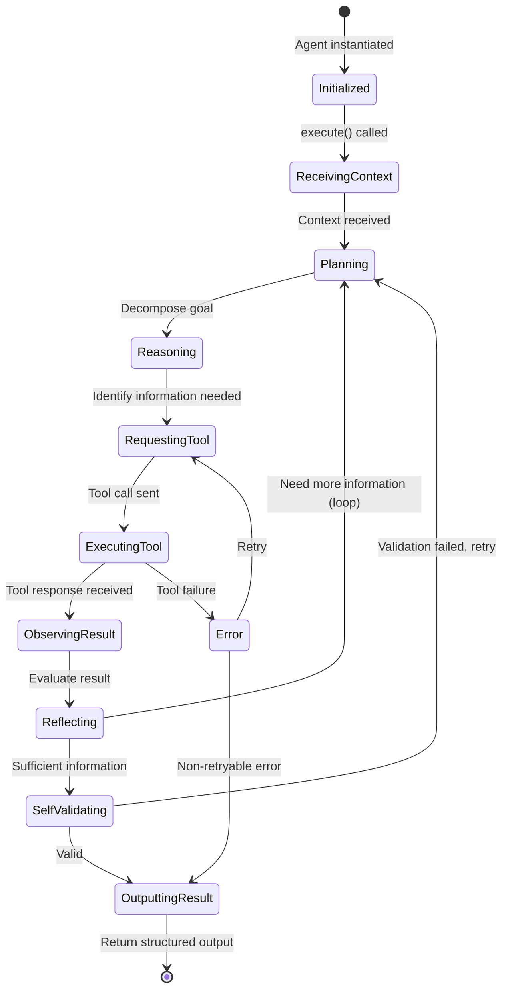
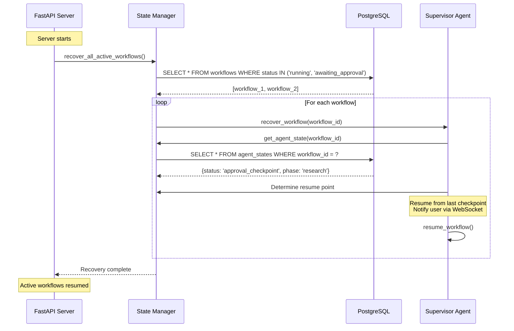

# Document 16 — Agent State Management

## Agent Lifecycle State Machine

Every agent follows the same internal state machine:



## State Persistence Strategy

```python
class AgentState:
    """Complete state of an agent at any point in its lifecycle."""

    agent_id: str
    workflow_id: UUID
    step_id: UUID

    # Execution state
    status: AgentStatus = AgentStatus.INITIALIZED
    current_phase: AgentPhase = AgentPhase.IDLE
    retry_count: int = 0
    max_retries: int = 3

    # ReAct loop state
    plan: str | None = None
    reasoning_history: list[ReasoningStep] = []
    tool_call_history: list[ToolCall] = []
    observations: list[Observation] = []
    reflections: list[Reflection] = []

    # Context management
    accumulated_context: list[dict] = []
    context_token_count: int = 0
    max_context_tokens: int = 32000

    # Output
    intermediate_outputs: dict[str, Any] = {}
    final_output: AgentOutput | None = None

    # Timing
    started_at: datetime | None = None
    current_step_started_at: datetime | None = None
    total_duration_ms: int = 0
```

## Persistence Model

```python
# Stores the full agent state in PostgreSQL for crash recovery

class AgentStateModel(Base):
    __tablename__ = "agent_states"

    id = Column(UUID, primary_key=True, default=uuid4)
    workflow_id = Column(UUID, ForeignKey("workflows.id"), nullable=False)
    agent_id = Column(String(100), nullable=False)
    step_id = Column(UUID, ForeignKey("workflow_steps.id"))

    # Serialized state
    status = Column(String(20), default="initialized")
    current_phase = Column(String(30), default="idle")
    retry_count = Column(Integer, default=0)

    # ReAct loop snapshots (compressed JSONB)
    reasoning_history = Column(JSONB, default=list)
    tool_call_history = Column(JSONB, default=list)
    observations = Column(JSONB, default=list)
    reflections = Column(JSONB, default=list)

    # Context
    context_token_count = Column(Integer, default=0)
    intermediate_outputs = Column(JSONB, default=dict)

    # Timing
    started_at = Column(DateTime(timezone=True))
    duration_ms = Column(Integer, default=0)

    created_at = Column(DateTime(timezone=True), server_default=func.now())
    updated_at = Column(DateTime(timezone=True), onupdate=func.now())

    __table_args__ = (
        Index("idx_agent_state_workflow", "workflow_id", "agent_id"),
    )
```

## Recovery Flow



## Checkpoint & Approval State

```python
class ApprovalState:
    """State management for human-in-the-loop checkpoints."""

    async def create_checkpoint(
        self, workflow_id: UUID, step_id: UUID,
        phase: str, output: AgentOutput
    ) -> ApprovalCheckpoint:
        checkpoint = ApprovalCheckpoint(
            workflow_id=workflow_id,
            step_id=step_id,
            phase=phase,
            status="pending",
            input_summary=self._summarize(output),
            output_snapshot=output.model_dump(),
            expires_at=datetime.utcnow() + timedelta(hours=72),
        )
        self.db.add(checkpoint)
        await self.db.commit()

        # Persist workflow state for crash recovery
        await self.state_manager.persist_state(workflow_id)

        # Notify user
        await self.event_bus.publish(WorkflowAwaitingApproval(
            workflow_id=workflow_id,
            checkpoint_id=checkpoint.id,
            phase=phase,
        ))

        return checkpoint

    async def resume_from_checkpoint(
        self, checkpoint_id: UUID, decision: str
    ) -> WorkflowResult | None:
        checkpoint = await self.db.get(ApprovalCheckpoint, checkpoint_id)
        if not checkpoint or checkpoint.status != "pending":
            raise ValueError("Checkpoint not found or already decided")

        checkpoint.status = decision
        checkpoint.decided_at = datetime.utcnow()

        if decision == "approved":
            # Resume workflow executor from this step
            return await self.workflow_engine.resume(checkpoint.workflow_id)

        # Rejected: return partial results
        return await self.aggregator.aggregate_partial(checkpoint.workflow_id)
```
