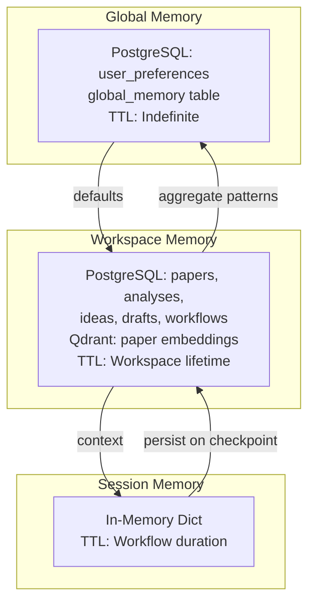

# Document 17 — Memory Architecture (Detailed)

## Three-Layer Memory Model



## Memory Layer Specifications

### Session Memory

| Property | Value |
|---|---|
| Storage | In-memory Python dict (asyncio-safe) |
| Scope | One workflow execution |
| TTL | Duration of workflow (minutes to hours) |
| Contents | Current agent context, ReAct loop state, intermediate tool outputs, conversation history, workflow state machine |
| Persistence | Not persisted alone; snapshot saved to PostgreSQL at checkpoints |
| Max size | Configurable (default 10MB per session) |

```python
class SessionMemory:
    """Per-workflow in-memory storage. Fast, transient."""

    def __init__(self, workflow_id: UUID):
        self.workflow_id = workflow_id
        self._store: dict[str, Any] = {}
        self._context_stack: list[AgentContext] = []
        self._lock = asyncio.Lock()

    async def push_context(self, message: AgentMessage):
        async with self._lock:
            self._context_stack.append(message)

    async def get_context(self) -> list[AgentMessage]:
        return self._context_stack.copy()

    async def set(self, key: str, value: Any):
        async with self._lock:
            self._store[key] = value

    async def get(self, key: str) -> Any | None:
        return self._store.get(key)

    async def snapshot(self) -> dict:
        """Capture current state for checkpoint persistence."""
        return {
            "context_stack": [m.model_dump() for m in self._context_stack],
            "store": self._store.copy(),
        }

    async def restore(self, snapshot: dict):
        """Restore state after crash recovery."""
        self._context_stack = [AgentContext(**m) for m in snapshot["context_stack"]]
        self._store = snapshot["store"]
```

### Workspace Memory

| Property | Value |
|---|---|
| Storage | PostgreSQL + Qdrant |
| Scope | One research topic |
| TTL | Until workspace deleted |
| Contents | Papers, embeddings, analyses, ideas, drafts, workflows, execution history, citation graph |

```python
class WorkspaceMemory:
    """Persistent storage for all artifacts within a workspace."""

    def __init__(self, workspace_id: UUID, db: AsyncSession, qdrant: QdrantClient):
        self.workspace_id = workspace_id
        self.db = db
        self.qdrant = qdrant

    async def add_paper(self, paper: Paper, chunks: list[Chunk],
                         embeddings: list[Embedding]):
        """Store paper with chunks and embeddings atomically."""
        async with self.db.begin():
            self.db.add(paper)
            for chunk in chunks:
                self.db.add(chunk)
            for emb in embeddings:
                self.db.add(emb)

        # Qdrant upsert (separate transaction)
        collection = get_collection_name(embeddings[0].model_id)
        await self.qdrant.upsert(collection, points=[
            PointStruct(id=e.vector_id, vector=e.vector, payload={
                "paper_id": str(paper.id),
                "workspace_id": str(self.workspace_id),
                "chunk_index": e.chunk_index,
                "model_id": e.model_id,
            }) for e in embeddings
        ])

    async def get_papers(self, limit: int = 20, offset: int = 0) -> list[Paper]:
        result = await self.db.execute(
            select(Paper).where(Paper.workspace_id == self.workspace_id)
            .order_by(Paper.created_at.desc())
            .limit(limit).offset(offset)
        )
        return result.scalars().all()

    async def get_analysis(self, analysis_type: str) -> Analysis | None:
        result = await self.db.execute(
            select(Analysis).where(
                Analysis.workspace_id == self.workspace_id,
                Analysis.analysis_type == analysis_type,
            ).order_by(Analysis.created_at.desc()).limit(1)
        )
        return result.scalar_one_or_none()
```

### Global Memory

| Property | Value |
|---|---|
| Storage | PostgreSQL (`global_memory` table) |
| Scope | All workspaces for one user |
| TTL | Indefinite |
| Contents | Prompt templates, execution patterns, user preferences, API keys, default settings |

```python
class GlobalMemory:
    """Cross-workspace persistent memory for a user."""

    def __init__(self, user_id: UUID, db: AsyncSession):
        self.user_id = user_id
        self.db = db

    async def save_prompt_template(self, name: str, template: str, tags: list[str] = None):
        entry = GlobalMemoryEntry(
            user_id=self.user_id,
            memory_type="prompt_template",
            key=name,
            value={"template": template},
            tags=tags or [],
        )
        self.db.add(entry)
        await self.db.commit()

    async def get_prompt_template(self, name: str) -> str | None:
        result = await self.db.execute(
            select(GlobalMemoryEntry).where(
                GlobalMemoryEntry.user_id == self.user_id,
                GlobalMemoryEntry.memory_type == "prompt_template",
                GlobalMemoryEntry.key == name,
            )
        )
        entry = result.scalar_one_or_none()
        return entry.value["template"] if entry else None

    async def record_execution_pattern(self, agent_id: str, pattern: dict):
        """Learn from successful executions for future optimization."""
        entry = GlobalMemoryEntry(
            user_id=self.user_id,
            memory_type="execution_pattern",
            key=f"{agent_id}_{datetime.utcnow().isoformat()}",
            value=pattern,
        )
        self.db.add(entry)
        await self.db.commit()
```

## Memory Manager Facade

```python
class MemoryManager:
    """Unified interface over all three memory layers."""

    def __init__(self, user_id: UUID, workspace_id: UUID | None,
                 workflow_id: UUID | None):
        self.user_id = user_id
        self.workspace_id = workspace_id
        self.workflow_id = workflow_id

    async def get_session(self) -> SessionMemory:
        if not hasattr(self, "_session"):
            self._session = SessionMemory(self.workflow_id)
        return self._session

    async def get_workspace(self) -> WorkspaceMemory:
        if not hasattr(self, "_workspace"):
            self._workspace = WorkspaceMemory(self.workspace_id, self.db, self.qdrant)
        return self._workspace

    async def get_global(self) -> GlobalMemory:
        if not hasattr(self, "_global"):
            self._global = GlobalMemory(self.user_id, self.db)
        return self._global
```

## Memory for RAG Context Assembly

```python
class ContextAssembler:
    """Assembles context for LLM prompts from all memory layers."""

    async def assemble(self, query: str, memory: MemoryManager,
                       max_tokens: int = 8000) -> str:
        """Build a context window combining relevant memories."""

        sections = []

        # 1. Global memory (prompt templates, preferences)
        global_mem = await memory.get_global()
        template = await global_mem.get_prompt_template("research_context")
        if template:
            sections.append(template)

        # 2. Workspace memory (relevant papers via semantic search)
        workspace = await memory.get_workspace()
        relevant = await workspace.search_semantic(query, limit=5)
        if relevant:
            papers_section = self._format_papers(relevant)
            sections.append(papers_section)

        # 3. Session memory (current conversation context)
        session = await memory.get_session()
        context = await session.get_context()
        if context:
            context_section = self._format_context(context)
            sections.append(context_section)

        # 4. Truncate to fit max_tokens
        combined = "\n\n".join(sections)
        return truncate_to_tokens(combined, max_tokens)
```
