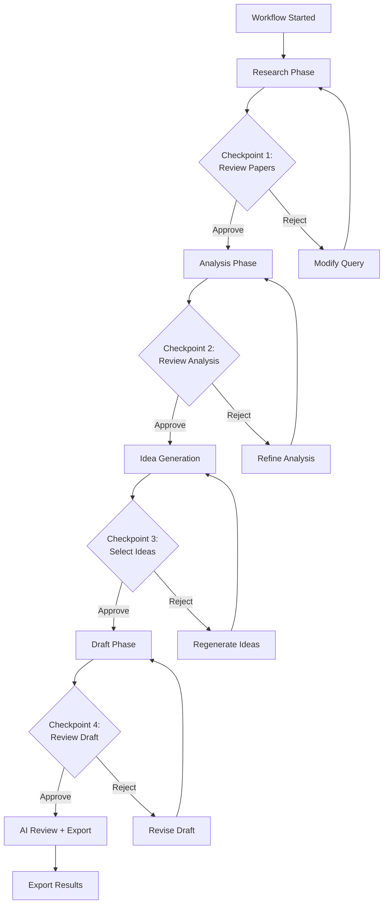

# Document 20 — Human-in-the-loop Design

## Checkpoint Strategy

Human checkpoints are placed at **every major phase transition** to ensure the researcher remains in control.



## Checkpoint Types

| Type | Trigger | What User Sees | Decision Options |
|---|---|---|---|
| `research_complete` | Research Agent finishes | Paper list with relevance scores | Approve / Reject / Modify query |
| `analysis_complete` | Analysis Agent finishes | Literature review, gaps, comparisons | Approve / Reject / Request refinement |
| `ideas_generated` | Idea Generation finishes | Ideas with overlap scores, experiment plans | Approve N ideas / Reject all / Regenerate |
| `draft_complete` | Writing Agent finishes | Section-by-section draft preview | Approve for review / Request revision |
| `review_complete` | Review Agent finishes | Review report with scores + issues | Export / Revise / Discard |

## API Design

```python
# List pending checkpoints
GET /api/v1/workflows/{id}/checkpoints
  → {checkpoints: [{id, phase, status, input_summary, created_at}]}

# Get checkpoint detail
GET /api/v1/approvals/{checkpoint_id}
  → {checkpoint_id, phase, status, input_summary, output_snapshot, created_at, expires_at}

# Approve a checkpoint
POST /api/v1/approvals/{checkpoint_id}/approve
  Body: {notes?: string}
  → {workflow_id, next_step, resumed_at}

# Reject a checkpoint
POST /api/v1/approvals/{checkpoint_id}/reject
  Body: {reason: string, action: "modify_query" | "refine" | "regenerate" | "revise"}
  → {workflow_id, action, instructions}
```

## Checkpoint UI Specification

The approval UI should display:

```
┌─────────────────────────────────────────────────────┐
│  ⏳ Awaiting Your Approval                           │
│                                                     │
│  ┌─────────────────────────────────────────────────┐│
│  │ Phase: Research Complete                        ││
│  │                                                 ││
│  │ Summary: Found 47 papers on "attention          ││
│  │ mechanisms in vision transformers" across        ││
│  │ 3 sources. 38 unique after dedup.               ││
│  │                                                 ││
│  │ Top Papers:                                     ││
│  │  1. [0.92] An Image is Worth 16x16 Words        ││
│  │  2. [0.88] Attention Is All You Need            ││
│  │  3. [0.85] Swin Transformer                     ││
│  │  ...                                            ││
│  │                                                 ││
│  │ Cost: $0.03 | Duration: 12s                     ││
│  └─────────────────────────────────────────────────┘│
│                                                     │
│  ┌─────────────────────────────────────────────────┐│
│  │ [View Full Results] [Modify Query]              ││
│  │                                                 ││
│  │        [ Reject ]    [ Approve & Continue ]     ││
│  └─────────────────────────────────────────────────┘│
└─────────────────────────────────────────────────────┘
```

## Notification Strategy

```python
class NotificationService:
    """Notifies users when checkpoints require attention."""

    async def notify_checkpoint(self, checkpoint: ApprovalCheckpoint):
        """Send in-app notification (email is Phase 2)."""

        # 1. WebSocket notification (if connected)
        await self.ws_manager.broadcast(
            checkpoint.workflow_id,
            {
                "type": "checkpoint.awaiting_approval",
                "checkpoint_id": str(checkpoint.id),
                "phase": checkpoint.phase,
                "summary": checkpoint.input_summary,
            }
        )

        # 2. In-app notification (stored in DB, shown on next login)
        notification = Notification(
            user_id=self._get_user_id(checkpoint.workflow_id),
            type="checkpoint_awaiting",
            title=f"Approval needed: {checkpoint.phase}",
            body=checkpoint.input_summary[:200],
            metadata={"checkpoint_id": str(checkpoint.id)},
        )
        self.db.add(notification)
        await self.db.commit()
```

## Timeout Handling

```python
TIMEOUT_DURATIONS = {
    "research_complete": timedelta(hours=72),
    "analysis_complete": timedelta(hours=72),
    "ideas_generated": timedelta(hours=48),
    "draft_complete": timedelta(hours=168),  # 7 days
    "review_complete": timedelta(hours=72),
}

async def timeout_checkpoints(scheduler):
    """Background task: expire stale checkpoints."""
    while True:
        expired = await db.execute(
            select(ApprovalCheckpoint).where(
                ApprovalCheckpoint.status == "pending",
                ApprovalCheckpoint.expires_at < datetime.utcnow(),
            )
        )
        for cp in expired.scalars():
            cp.status = "expired"
            # Cancel the workflow with partial results
            await workflow_engine.cancel(
                cp.workflow_id,
                reason="Approval checkpoint expired",
            )
        await db.commit()
        await asyncio.sleep(3600)  # Check every hour
```

## Design Rationale

| Decision | Rationale |
|---|---|
| Checkpoints at every phase transition | Ensures researcher never loses control; each phase output is reviewable |
| 72-hour default timeout | Balances flexibility with system resource cleanup |
| In-app notifications (v1), email (v2) | Simpler implementation; email requires SMTP/Resend setup |
| Reject can include action instruction | Gives user agency; the system retries with modified input |
| Approve/Reject is explicit, not implicit | No auto-approve for safety; even low-risk steps require explicit confirmation |
