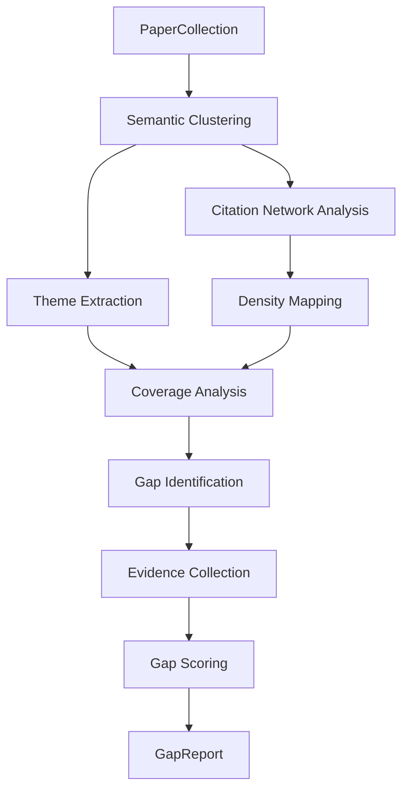

# Document 21 — Research Gap Analysis Design

## Gap Detection Methodology

The Analysis Agent identifies research gaps through a structured process combining semantic clustering, citation analysis, and LLM reasoning.



## Gap Detection Pipeline

```python
class GapAnalysisService:
    """Identifies research gaps from a collection of papers."""

    async def analyze(self, papers: list[Paper], topic: str) -> GapReport:
        # Step 1: Cluster papers semantically
        clusters = await self._cluster_papers(papers)

        # Step 2: Extract themes per cluster
        themes = await self._extract_themes(clusters)

        # Step 3: Analyze coverage
        coverage = self._analyze_coverage(themes, papers)

        # Step 4: Identify gaps
        gaps = await self._identify_gaps(themes, coverage, topic, papers)

        # Step 5: Score and rank gaps
        ranked = self._score_gaps(gaps)

        return GapReport(themes=themes, coverage=coverage, gaps=ranked)

    async def _cluster_papers(self, papers: list[Paper]) -> list[PaperCluster]:
        """Group papers by methodological/topical similarity."""
        # Use embeddings from Qdrant for clustering
        embeddings = [await self.embedder.embed(p.abstract or p.title)
                      for p in papers]

        # K-means clustering (k = sqrt(n/2))
        k = max(2, int(math.sqrt(len(papers) / 2)))
        kmeans = KMeans(n_clusters=k, random_state=42)
        labels = kmeans.fit_predict(embeddings)

        clusters = defaultdict(list)
        for paper, label in zip(papers, labels):
            clusters[label].append(paper)

        return [PaperCluster(id=i, papers=cluster)
                for i, cluster in clusters.items()]

    async def _extract_themes(self, clusters: list[PaperCluster]) -> list[Theme]:
        """Summarize each cluster into a research theme."""
        themes = []
        for cluster in clusters:
            # Use LLM to extract common methodology, dataset, contribution
            prompt = f"""
            Analyze these {len(cluster.papers)} papers and identify:
            1. Common methodology
            2. Common datasets
            3. Common research questions
            4. Key findings

            Papers: {[p.title for p in cluster.papers[:10]]}
            """
            theme_data = await self.llm.extract_structured(prompt, ThemeSchema)
            themes.append(Theme(
                name=theme_data.name,
                methodology=theme_data.methodology,
                papers=cluster.papers,
                key_findings=theme_data.findings,
            ))
        return themes

    async def _identify_gaps(self, themes: list[Theme],
                               coverage: CoverageAnalysis,
                               topic: str,
                               papers: list[Paper]) -> list[ResearchGap]:
        """Identify research gaps by analyzing what's missing."""
        gaps = []

        # Method 1: Cross-theme gaps (combinations not explored)
        for i, t1 in enumerate(themes):
            for t2 in themes[i+1:]:
                if self._combination_not_explored(t1, t2, papers):
                    gaps.append(ResearchGap(
                        gap_type="method_combination",
                        description=f"No work combines {t1.name} with {t2.name}",
                        evidence=[t1.papers[0], t2.papers[0]],
                        confidence=0.6,
                    ))

        # Method 2: Dataset gaps (important datasets not used with certain methods)
        popular_datasets = self._get_popular_datasets(papers)
        for method_theme in themes:
            unused = [d for d in popular_datasets
                      if d not in method_theme.datasets_used]
            if unused:
                gaps.append(ResearchGap(
                    gap_type="dataset",
                    description=f"Dataset {unused[0]} not explored with {method_theme.name}",
                    evidence=method_theme.papers[:2],
                    confidence=0.7,
                ))

        # Method 3: Temporal gaps (declining or surging topics)
        recent_papers = [p for p in papers
                         if p.publication_date and p.publication_date > datetime(2024, 1, 1)]
        if len(recent_papers) < len(papers) * 0.1:
            gaps.append(ResearchGap(
                gap_type="temporal",
                description="Limited recent work in this area",
                evidence=papers[-3:],
                confidence=0.5,
            ))

        return gaps

    def _score_gaps(self, gaps: list[ResearchGap]) -> list[ResearchGap]:
        """Score gaps by estimated impact and feasibility."""
        for gap in gaps:
            gap.impact_score = self._estimate_impact(gap)
            gap.feasibility_score = self._estimate_feasibility(gap)
            gap.composite_score = (
                0.5 * gap.impact_score +
                0.3 * gap.confidence +
                0.2 * gap.feasibility_score
            )

        return sorted(gaps, key=lambda g: g.composite_score, reverse=True)
```

## Gap Report Schema

```python
class ResearchGap(BaseModel):
    gap_type: Literal["method_combination", "dataset", "temporal",
                      "domain_application", "evaluation", "theory"]
    description: str
    evidence: list[Paper]  # Supporting papers
    confidence: float  # 0-1
    impact_score: float  # 0-1
    feasibility_score: float  # 0-1
    composite_score: float
    suggested_direction: str | None = None

class CoverageAnalysis(BaseModel):
    total_papers: int
    theme_count: int
    coverage_map: dict[str, float]  # theme → % of papers
    density_score: float  # 0-1, how well-distributed papers are
    blind_spots: list[str]  # Topics with <2 papers

class GapReport(BaseModel):
    themes: list[Theme]
    coverage: CoverageAnalysis
    gaps: list[ResearchGap]
    summary: str  # LLM-generated overview
```

## Trade-offs

| Decision | Rationale |
|---|---|
| K-means clustering (not HDBSCAN) | Simpler, deterministic; student-friendly |
| LLM-based theme extraction | More accurate than pure keyword extraction |
| Three gap types (method, dataset, temporal) | Covers most common research gaps without over-engineering |
| Heuristic gap scoring | No training data required; rankings are directional, not absolute |
| Evidence linking | Every gap is supported by specific papers — no fabricated gaps |
