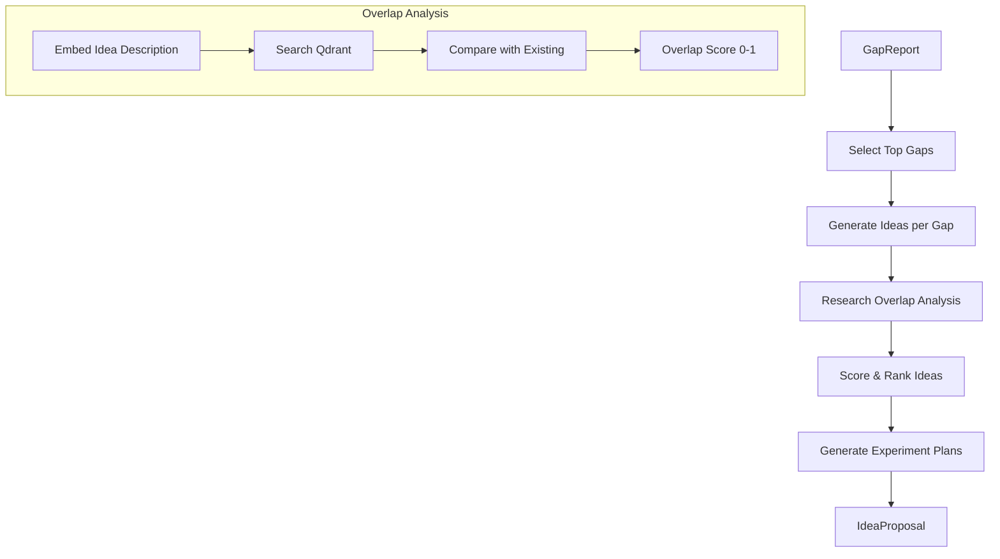

# Document 22 — Research Idea Generation

## Idea Generation Pipeline



## Idea Generation Agent (Full ReAct)

```python
class IdeaGenerationAgent(BaseAgent):
    """Generates novel research ideas from gap analysis."""

    agent_id = "idea_generator"
    agent_name = "Idea Generation Agent"
    max_retries = 2

    async def execute(self, context: AgentContext) -> IdeaProposal:
        """Full ReAct loop for idea generation."""
        report: GapReport = context.input["gap_report"]

        self.log(f"Generating ideas from {len(report.gaps)} gaps")

        ideas = []

        for gap in report.gaps[:5]:  # Process top 5 gaps
            # PLAN: Approach this gap
            # REASON: What kind of idea would address this gap?
            gap_summary = f"Gap: {gap.description} (confidence: {gap.confidence:.2f})"

            self.log(f"Processing gap: {gap.description}")

            # Generate multiple ideas per gap
            idea_prompt = f"""
            Research Gap: {gap.description}
            Evidence: {[p.title for p in gap.evidence[:3]]}
            Suggested Direction: {gap.suggested_direction or "Not specified"}

            Generate 2-3 concrete research ideas that address this gap.
            For each idea:
            1. Title (concise, specific)
            2. Hypothesis
            3. Proposed methodology
            4. Required resources
            5. Expected contribution

            Output as structured JSON.
            """

            raw_ideas = await self.llm.infer(idea_prompt, IdeaListSchema)

            for raw in raw_ideas.ideas:
                # Check overlap with existing literature
                overlap = await self._calculate_overlap(raw.description)

                idea = ResearchIdea(
                    title=raw.title,
                    description=raw.description,
                    hypothesis=raw.hypothesis,
                    methodology=raw.methodology,
                    research_gap=gap.description,
                    overlap_score=overlap.score,
                    overlapping_papers=overlap.papers,
                    resources_required=raw.resources,
                    expected_contribution=raw.contribution,
                )
                ideas.append(idea)

        # Score and rank
        ranked = self._rank_ideas(ideas)

        # Generate experiment plans for top 3
        for idea in ranked[:3]:
            idea.experiment_plan = await self._generate_experiment_plan(idea)

        return IdeaProposal(ideas=ranked)
```

## Research Overlap Analysis

```python
class OverlapAnalysisService:
    """Compares proposed ideas against existing literature."""

    async def analyze(self, idea_description: str,
                       workspace_id: UUID) -> OverlapResult:
        # 1. Embed the idea
        idea_vector = await self.embedder.embed(idea_description)

        # 2. Search for similar papers
        results = await self.vector_db.search(
            collection=get_collection_name(self.embedder.model_id),
            query_vector=idea_vector,
            limit=10,
            score_threshold=0.6,  # Only consider significant overlap
            query_filter=Filter(must=[
                FieldCondition(key="workspace_id",
                               match=MatchValue(value=str(workspace_id)))
            ])
        )

        # 3. Calculate overlap score
        if not results:
            return OverlapResult(score=0.0, papers=[])

        # Weighted score: higher similarity = higher overlap
        scores = [r.score for r in results]
        weighted_score = sum(s * w for s, w in zip(scores,
                            self._linear_weights(len(scores))))

        # 4. Identify most overlapping papers
        overlapping = []
        for r in results[:5]:
            paper = await self._get_paper(r.payload["paper_id"])
            overlapping.append(OverlappingPaper(
                paper_id=paper.id,
                title=paper.title,
                abstract=paper.abstract[:200] if paper.abstract else "",
                similarity=r.score,
                section=r.payload.get("section_name"),
            ))

        return OverlapResult(
            score=min(weighted_score, 0.95),  # Cap at 0.95
            papers=overlapping,
            interpretation=self._interpret_score(weighted_score),
        )

    def _interpret_score(self, score: float) -> str:
        if score < 0.2:
            return "Idea appears distinct from existing work"
        elif score < 0.4:
            return "Partial overlap with existing work; consider refining direction"
        elif score < 0.6:
            return "Significant overlap with existing work; novel contribution must be clearly differentiated"
        else:
            return "High overlap — idea closely matches existing work; consider a different direction"

    @staticmethod
    def _linear_weights(n: int) -> list[float]:
        """Linearly decreasing weights for top-k results."""
        if n == 0:
            return []
        total = n * (n + 1) / 2
        return [(n - i) / total for i in range(n)]
```

## Experiment Plan Generation

```python
async def _generate_experiment_plan(self, idea: ResearchIdea) -> ExperimentPlan:
    prompt = f"""
    Research Idea: {idea.title}
    Description: {idea.description}
    Hypothesis: {idea.hypothesis}
    Methodology: {idea.methodology}

    Design a detailed experiment plan:
    1. Research questions (2-3 specific questions)
    2. Datasets needed (with justification)
    3. Baseline methods to compare against
    4. Evaluation metrics
    5. Experimental setup (hardware, software, hyperparameters)
    6. Statistical tests to use
    7. Ablation studies
    8. Expected results (with [HYPOTHETICAL] tag)

    Output as structured JSON.
    """

    return await self.llm.infer(prompt, ExperimentPlanSchema)
```

## Idea Scoring Formula

```python
def score_idea(idea: ResearchIdea) -> float:
    novelty = 1.0 - idea.overlap_score  # Lower overlap = more novel
    feasibility = min(1.0, idea.resources_required.estimate / 1000)
    gap_importance = idea.gap_confidence
    clarity = len(idea.description.split()) / 500  # Normalize to 0-1

    return (
        0.35 * novelty +
        0.25 * feasibility +
        0.25 * gap_importance +
        0.15 * clarity
    )
```

## UI Display

```
┌─────────────────────────────────────────────────────────────┐
│ Research Ideas                                              │
│                                                             │
│ ┌─────────────────────────────────────────────────────────┐ │
│ │ ★★★★☆  Novelty: 0.78  Feasibility: 0.65               │ │
│ │                                                         │ │
│ │ Title: Cross-Attention Between Modalities for           │ │
│ │        Few-Shot Medical Image Segmentation              │ │
│ │                                                         │ │
│ │ Gap Addressed: No existing work combines cross-attention │ │
│ │ with few-shot learning in medical imaging               │ │
│ │                                                         │ │
│ │ Overlap Analysis: Partial overlap (0.32)                │ │
│ │ Overlapping Papers:                                     │ │
│ │   • [0.45] Few-Shot Medical Segmentation (2023)         │ │
│ │   • [0.38] Cross-Attention in Vision (2022)             │ │
│ │                                                         │ │
│ │ [View Experiment Plan]  [Approve]  [Reject]             │ │
│ └─────────────────────────────────────────────────────────┘ │
└─────────────────────────────────────────────────────────────┘
```
