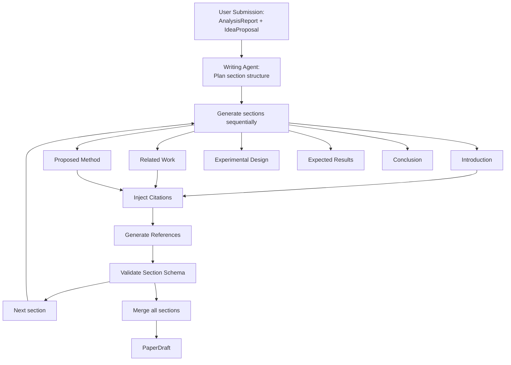

# Document 23 — Paper Draft Generation

## Draft Generation Pipeline



## Writing Agent (Tier 2: Structured Generation + Reflection)

```python
class WritingAgent(BaseAgent):
    """Generates structured research paper drafts."""

    agent_id = "writer"
    agent_name = "Writing Agent"
    max_retries = 3

    async def execute(self, context: AgentContext) -> PaperDraft:
        analysis: AnalysisReport = context.input["analysis"]
        ideas: IdeaProposal | None = context.input.get("ideas")
        template: WritingTemplate = context.input.get("template", WritingTemplate.GENERIC)

        sections = []

        # Sequential section generation (each section sees previous ones)
        for section_def in self._get_section_order(template):
            section = await self._generate_section(
                section_def=section_def,
                analysis=analysis,
                ideas=ideas,
                previous_sections=sections,
                template=template,
            )
            sections.append(section)

        # Assemble full draft
        draft = PaperDraft(
            title=await self._generate_title(analysis, ideas),
            sections=sections,
            references=self._collect_references(sections),
            template=template,
        )

        # Self-reflection pass
        reflection = await self._reflect(draft)
        if reflection.issues:
            for issue in reflection.issues:
                draft = await self._fix_issue(draft, issue)

        return draft

    async def _generate_section(self, section_def: SectionDefinition,
                                  analysis: AnalysisReport,
                                  ideas: IdeaProposal | None,
                                  previous_sections: list[Section],
                                  template: WritingTemplate) -> Section:
        """Generate a single section with inline citations."""

        prompt = f"""
        You are writing a research paper section: {section_def.name}

        {section_def.description}

        Available context:
        - Analysis: {analysis.summary}
        - {'Ideas: ' + ideas.ideas[0].title if ideas else 'No specific ideas'}
        - Papers available: {len(analysis.themes)} themes with {sum(len(t.papers) for t in analysis.themes)} papers

        Previous sections:
        {self._summarize_previous(previous_sections)}

        Template format: {template.value}

        RULES:
        1. Every factual claim MUST have an inline citation: [@doi_or_paper_id]
        2. Use papers from the analysis as citation sources
        3. Keep the section focused on the specified topic
        4. Use academic writing style
        5. Mark speculative content with [HYPOTHETICAL]
        6. Output as structured JSON: {{"content": "section text", "citations": [{{"paper_id", "context"}}]}}
        7. Target length: {section_def.target_words} words
        """

        raw = await self.llm.infer(prompt, SectionSchema)

        return Section(
            name=section_def.name,
            content=raw.content,
            citations=[Citation(paper_id=c.paper_id, context=c.context)
                      for c in raw.citations],
            word_count=len(raw.content.split()),
        )
```

## Section Definitions by Template

```python
class SectionDefinition(BaseModel):
    name: str
    description: str
    target_words: int
    required: bool = True

SECTION_ORDERS = {
    "generic": [
        SectionDefinition("abstract", "Abstract summarizing the entire paper", 200),
        SectionDefinition("introduction", "Motivation, problem statement, contributions", 500),
        SectionDefinition("related_work", "Synthesis of existing literature", 800),
        SectionDefinition("proposed_method", "Technical description of the approach", 1000),
        SectionDefinition("experimental_design", "Experimental setup, datasets, metrics", 600),
        SectionDefinition("expected_results", "Hypothetical results with [HYPOTHETICAL] tags", 400),
        SectionDefinition("discussion", "Implications, limitations, future work", 500),
        SectionDefinition("conclusion", "Summary of contributions", 300),
    ],
    "ieee": [
        SectionDefinition("abstract", "Abstract", 150),
        SectionDefinition("introduction", "Introduction", 400),
        SectionDefinition("related_work", "Related Work", 600),
        SectionDefinition("methodology", "Proposed Method", 1000),
        SectionDefinition("experiments", "Experimental Results", 800),
        SectionDefinition("conclusion", "Conclusion", 300),
    ],
    "acm": [
        SectionDefinition("abstract", "Abstract", 150),
        SectionDefinition("introduction", "Introduction", 500),
        SectionDefinition("background", "Background and Motivation", 500),
        SectionDefinition("method", "Methodology", 1000),
        SectionDefinition("evaluation", "Evaluation", 800),
        SectionDefinition("discussion", "Discussion", 400),
        SectionDefinition("conclusion", "Conclusion and Future Work", 300),
    ],
}
```

## Citation Injection Strategy

```python
class CitationInjector:
    """Manages inline citations within the draft."""

    def __init__(self, papers: list[Paper]):
        self.paper_map = {p.id: p for p in papers}
        self.citation_counter = 0

    def format_citation(self, paper_id: UUID, format: str = "ieee") -> str:
        """Generate formatted citation key."""
        paper = self.paper_map.get(paper_id)
        if not paper:
            return f"[?{paper_id}]"

        self.citation_counter += 1

        if format == "ieee":
            return f"[{self.citation_counter}]"
        elif format == "acm":
            authors = paper.authors[0].name.split()[-1] if paper.authors else "Unknown"
            year = paper.publication_date.year if paper.publication_date else "n.d."
            return f"[{authors} {year}]"
        elif format == "springer":
            authors = paper.authors[0].name.split()[-1] if paper.authors else "Unknown"
            year = paper.publication_date.year if paper.publication_date else "n.d."
            return f"({authors}, {year})"
        else:
            return f"[@{paper_id}]"
```

## Draft Schema

```python
class PaperDraft(BaseModel):
    title: str
    sections: list[Section]
    references: list[FormattedReference]
    template: WritingTemplate
    word_count: int
    has_hypothetical_content: bool = False
    disclaimer: str = (
        "This draft was AI-generated to assist the research process. "
        "It requires human review, verification, and editing before "
        "any submission for publication. The authors bear full "
        "responsibility for the content."
    )

class Section(BaseModel):
    name: str
    content: str
    citations: list[Citation]
    word_count: int

class Citation(BaseModel):
    paper_id: UUID
    context: str  # How the paper is used
```

## Self-Reflection Pass

```python
async def _reflect(self, draft: PaperDraft) -> ReflectionReport:
    """Review the draft for quality issues before returning."""

    prompt = f"""
    Review this research paper draft for quality issues:

    Title: {draft.title}
    Sections: {[s.name for s in draft.sections]}
    Total words: {draft.word_count}

    Check each:
    1. Does every section have at least one citation?
    2. Is there a clear contribution statement?
    3. Is the abstract complete?
    4. Are there sections with very low word count?
    5. Are citations distributed across sections?

    Return issues as structured JSON.
    """

    return await self.llm.infer(prompt, ReflectionReportSchema)
```

## Trade-offs

| Decision | Rationale |
|---|---|
| Sequential section generation | Each section can reference previous ones; avoids contradictory content |
| Self-reflection pass | Catches missing citations, empty sections without another agent |
| Template-based sections | Ensures output matches target venue format |
| [HYPOTHETICAL] markers | Clearly distinguishes generated content from factual claims |
| Citation injection during generation | More accurate than post-hoc citation; context matches the reference |
