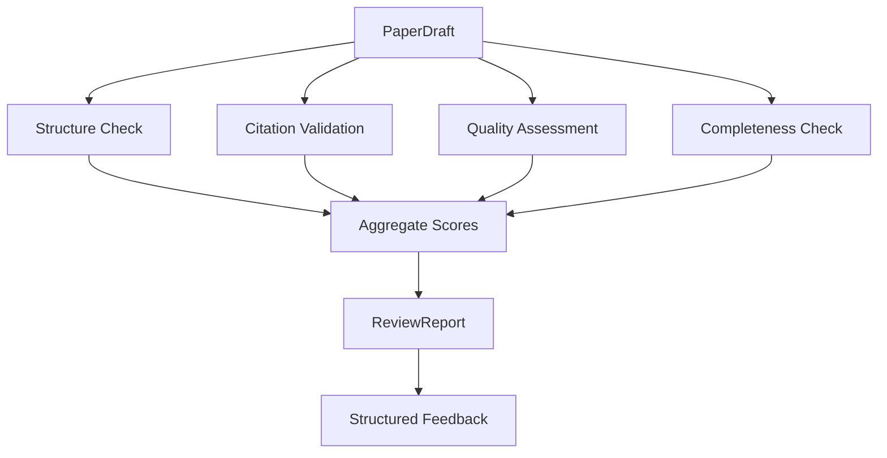

# Document 24 — Review Pipeline

## Review Architecture



## Review Agent (Full ReAct)

```python
class ReviewAgent(BaseAgent):
    """Reviews paper drafts for quality, citation validity, and completeness."""

    agent_id = "reviewer"
    agent_name = "Review Agent"
    max_retries = 2

    async def execute(self, context: AgentContext) -> ReviewReport:
        draft: PaperDraft = context.input["draft"]
        papers: list[Paper] = context.input.get("papers", [])

        # Step 1: Structure check
        structure = await self._check_structure(draft)

        # Step 2: Citation validation (uses tool)
        citations = await self._validate_citations(draft, papers)

        # Step 3: Quality assessment (LLM)
        quality = await self._assess_quality(draft)

        # Step 4: Completeness check
        completeness = await self._check_completeness(draft)

        # Step 5: Aggregate
        overall_score = self._calculate_overall(structure, citations, quality, completeness)

        return ReviewReport(
            overall_score=overall_score,
            structure=structure,
            citation_accuracy=citations,
            quality=quality,
            completeness=completeness,
            issues=self._collect_issues(structure, citations, quality, completeness),
            suggestions=self._generate_suggestions(quality, completeness),
        )

    async def _validate_citations(self, draft: PaperDraft,
                                    papers: list[Paper]) -> CitationAccuracy:
        """Use crossref tool to validate each DOI."""
        paper_map = {str(p.id): p for p in papers}
        total = 0
        valid = 0
        invalid = []
        not_found = []

        for section in draft.sections:
            for citation in section.citations:
                total += 1
                paper = paper_map.get(str(citation.paper_id))

                if paper and paper.doi:
                    # Use citation_validate tool
                    result = await self.tool_router.execute(
                        "citation_validate",
                        {"doi": paper.doi}
                    )
                    if result.is_valid:
                        valid += 1
                    else:
                        invalid.append({
                            "paper_id": str(citation.paper_id),
                            "doi": paper.doi,
                            "error": result.error,
                        })
                else:
                    not_found.append({
                        "paper_id": str(citation.paper_id),
                        "doi": paper.doi if paper else None,
                    })

        return CitationAccuracy(
            total_citations=total,
            valid_citations=valid,
            invalid_citations=invalid,
            citations_not_found=not_found,
            accuracy=valid / total if total > 0 else 0,
        )

    async def _assess_quality(self, draft: PaperDraft) -> QualityAssessment:
        scores = {}
        for section in draft.sections:
            prompt = f"""
            Rate this section on a scale of 1-5 for:
            - clarity: Is the writing clear and understandable?
            - coherence: Does the section flow logically?
            - citation_use: Are citations used appropriately?
            - specificity: Are claims specific and well-supported?

            Section: {section.name}
            Content: {section.content[:1000]}...

            Return JSON with scores and brief justification.
            """
            result = await self.llm.infer(prompt, SectionQualitySchema)
            scores[section.name] = result

        overall = sum(s.clarity + s.coherence + s.citation_use + s.specificity
                     for s in scores.values()) / (len(scores) * 4)

        return QualityAssessment(section_scores=scores, overall=overall)
```

## Review Criteria

### 1. Structure Check
| Criterion | Weight | Method |
|---|---|---|
| All required sections present | 30% | Template comparison |
| Section order correct | 20% | Template comparison |
| Abstract covers key elements | 25% | LLM check (motivation, method, result, conclusion) |
| References section present | 25% | Regex check for references heading |

### 2. Citation Validation
| Check | Method | Possible Status |
|---|---|---|
| DOI exists | Crossref API | `valid` / `invalid` / `not_found` |
| Citation in reference list | Cross-reference IDs | `present` / `missing` |
| Claim has citation | LLM check of each paragraph | `cited` / `uncited` |

### 3. Quality Assessment (1-5)
| Dimension | Description |
|---|---|
| Clarity | Writing is clear, concise, and readable |
| Coherence | Section flows logically; transitions are smooth |
| Citation Use | Citations are relevant and appropriately placed |
| Specificity | Claims are specific and supported by evidence |
| Originality | Work is positioned relative to existing literature |

### 4. Completeness
| Check | Pass Criteria |
|---|---|
| Abstract < 250 words | Yes |
| Introduction has problem statement | Yes |
| Method section exists | Yes (for experimental papers) |
| Discussion has limitations | Yes |
| Conclusion summarizes contributions | Yes |
| References ≥ 10 | Yes |

## Review Report Schema

```python
class ReviewReport(BaseModel):
    overall_score: float  # 0-1

    # Sub-scores
    structure: StructureScore
    citation_accuracy: CitationAccuracy
    quality: QualityAssessment
    completeness: CompletenessScore

    # Aggregated
    issues: list[ReviewIssue]
    suggestions: list[str]

    # Metadata
    reviewed_at: datetime = Field(default_factory=datetime.utcnow)
    reviewer_model: str = "gpt-4o-mini"
    citation_validation_cost: Decimal

class ReviewIssue(BaseModel):
    severity: Literal["critical", "major", "minor", "suggestion"]
    category: Literal["structure", "citation", "quality", "completeness"]
    section: str | None
    description: str
    suggestion: str | None
```

## Score Aggregation

```python
def _calculate_overall(self, structure: StructureScore,
                        citations: CitationAccuracy,
                        quality: QualityAssessment,
                        completeness: CompletenessScore) -> float:
    """Weighted average of all review dimensions."""
    return (
        0.20 * structure.score +
        0.25 * citations.accuracy +
        0.35 * quality.overall / 5.0 +  # Normalize 1-5 to 0-1
        0.20 * completeness.score
    )
```
