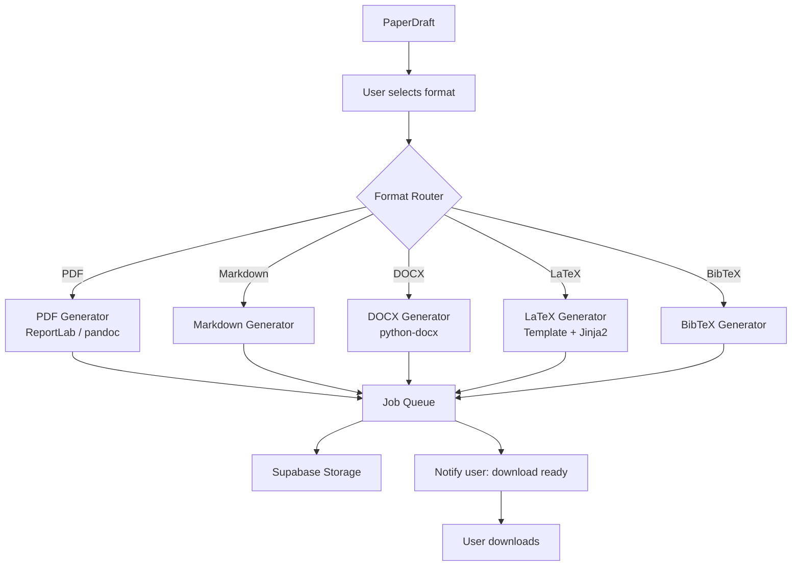

# Document 25 — Export Pipeline

## Export Architecture



## Export Interface

```python
class BaseExporter(ABC):
    """Interface for all export format generators."""

    exporter_id: str
    exporter_name: str
    supported_formats: list[str]

    @abstractmethod
    async def export(self, draft: PaperDraft, template: str = "generic",
                     options: ExportOptions | None = None) -> ExportResult:
        """Convert draft to the target format."""
        ...

    @abstractmethod
    async def get_file_extension(self) -> str: ...

    @abstractmethod
    async def get_mime_type(self) -> str: ...

class ExportResult(BaseModel):
    file_path: str
    file_name: str
    file_size_bytes: int
    format: str
    word_count: int
    page_count: int | None
    success: bool
    errors: list[str] = []
```

## Format Generators

### Markdown Generator (Simplest)
```python
class MarkdownExporter(BaseExporter):
    exporter_id = "markdown"
    exporter_name = "Markdown"

    async def export(self, draft: PaperDraft, **kwargs) -> ExportResult:
        lines = []

        # Title
        lines.append(f"# {draft.title}\n")

        # Disclaimer
        lines.append(f"> {draft.disclaimer}\n")

        # Sections
        for section in draft.sections:
            lines.append(f"## {section.name.replace('_', ' ').title()}\n")
            lines.append(section.content)
            lines.append("")

        # References
        lines.append("## References\n")
        for ref in draft.references:
            lines.append(f"- {ref.formatted}")

        content = "\n".join(lines)
        path = f"/tmp/exports/{draft.id}.md"
        with open(path, "w") as f:
            f.write(content)

        return ExportResult(
            file_path=path,
            file_name=f"{draft.title[:50]}.md",
            file_size_bytes=len(content.encode()),
            format="markdown",
            word_count=len(content.split()),
            success=True,
        )
```

### LaTeX Generator (Template-based)
```python
class LatexExporter(BaseExporter):
    exporter_id = "latex"
    exporter_name = "LaTeX"

    def __init__(self):
        self.templates = {
            "ieee": "templates/ieee.tex.j2",
            "acm": "templates/acm.tex.j2",
            "springer": "templates/springer.tex.j2",
            "generic": "templates/generic.tex.j2",
        }

    async def export(self, draft: PaperDraft, template: str = "generic",
                     options: ExportOptions | None = None) -> ExportResult:

        template_path = self.templates.get(template, self.templates["generic"])

        # Load Jinja2 template
        env = Environment(loader=FileSystemLoader("."))
        tmpl = env.get_template(template_path)

        # Render
        latex_content = tmpl.render(
            title=draft.title,
            sections=[{
                "name": s.name.replace("_", " ").title(),
                "content": s.content,
                "citations": s.citations,
            } for s in draft.sections],
            references=[ref.formatted for ref in draft.references],
            disclaimer=draft.disclaimer,
        )

        path = f"/tmp/exports/{draft.id}.tex"
        with open(path, "w") as f:
            f.write(latex_content)

        return ExportResult(
            file_path=path,
            file_name=f"{draft.title[:50]}.tex",
            file_size_bytes=len(latex_content.encode()),
            format="latex",
            word_count=len(latex_content.split()),
            success=True,
        )
```

### BibTeX Generator
```python
class BibtexExporter(BaseExporter):
    exporter_id = "bibtex"
    exporter_name = "BibTeX"

    async def export(self, draft: PaperDraft, **kwargs) -> ExportResult:
        entries = []
        for i, ref in enumerate(draft.references):
            key = f"{ref.first_author_last_name}{ref.year or 'n.d'}{i}"
            entry = f"@article{{{key},\n"
            if ref.title:
                entry += f"  title = {{{ref.title}}},\n"
            if ref.authors:
                entry += f"  author = {{{' and '.join(ref.authors)}}},\n"
            if ref.year:
                entry += f"  year = {{{ref.year}}},\n"
            if ref.doi:
                entry += f"  doi = {{{ref.doi}}},\n"
            if ref.venue:
                entry += f"  journal = {{{ref.venue}}},\n"
            entry += "}\n"
            entries.append(entry)

        content = "\n".join(entries)
        path = f"/tmp/exports/{draft.id}.bib"
        with open(path, "w") as f:
            f.write(content)

        return ExportResult(
            file_path=path,
            file_name=f"{draft.title[:50]}.bib",
            file_size_bytes=len(content.encode()),
            format="bibtex",
            word_count=0,
            success=True,
        )
```

## Export Service API

```python
class ExportService:
    """Coordinates export generation via background jobs."""

    async def start_export(self, draft_id: UUID, format: str,
                            template: str = "generic") -> ExportJob:
        """Start export in background job."""
        job_id = await self.job_queue.enqueue(
            "generate_export",
            payload={
                "draft_id": str(draft_id),
                "format": format,
                "template": template,
            }
        )
        return ExportJob(job_id=job_id, status="queued")

    async def get_export_status(self, job_id: str) -> ExportJob:
        status = await self.job_queue.get_status(job_id)
        return ExportJob(job_id=job_id, status=status)

    async def download_export(self, job_id: str) -> ExportResult:
        """Get the completed export file."""
        result = await self.job_queue.get_result(job_id)
        if not result:
            raise ValueError("Export not ready or not found")
        return ExportResult(**result)
```

## Template System

```
backend/app/templates/
  ieee.tex.j2           # IEEE LaTeX template
  acm.tex.j2            # ACM LaTeX template
  springer.tex.j2       # Springer LaTeX template
  generic.tex.j2        # Generic academic LaTeX template

  ieee.cls              # IEEE class file (included for compilation)
  acm.cls               # ACM class file
  spbasic.bst           # Springer BibTeX style
```

## Export Formats Summary

| Format | Exporter | File Ext | MIME Type | Features |
|---|---|---|---|---|
| Markdown | MarkdownExporter | .md | text/markdown | Fastest, simplest, no formatting restrictions |
| PDF | pandoc (LaTeX → PDF) | .pdf | application/pdf | Highest fidelity, needs LaTeX installed |
| DOCX | python-docx | .docx | application/vnd.openxmlformats | Microsoft Word compatible |
| LaTeX | LatexExporter | .tex | application/x-tex | Overleaf/ArXiv compatible |
| BibTeX | BibtexExporter | .bib | application/x-bibtex | Reference manager compatible |

## Trade-offs

| Decision | Rationale |
|---|---|
| pandoc for PDF (not direct generation) | pandoc handles LaTeX → PDF compilation; student doesn't need to implement PDF rendering |
| Jinja2 templates for LaTeX | Clean separation of template and content; format changes don't require code changes |
| Background job for exports | Large PDFs take seconds to generate; non-blocking is essential for UX |
| Supabase Storage for exports | Unified storage with PDFs; easy download URL generation |
