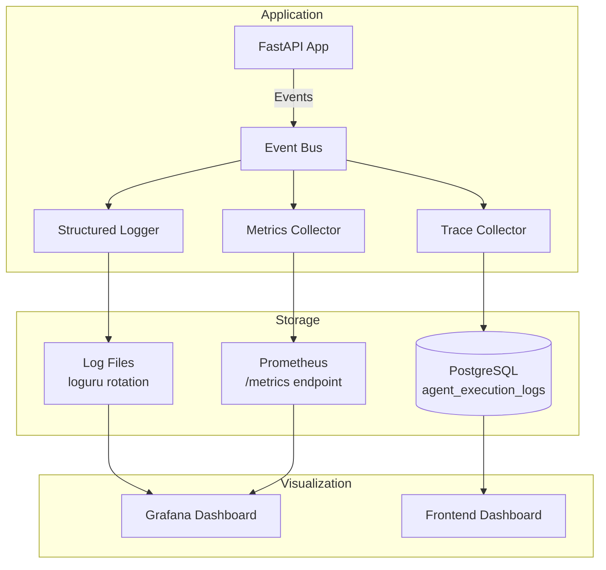

# Document 28 — Monitoring & Logging

## Observability Architecture



## Structured Logging

```python
# backend/app/core/logging.py

from loguru import logger
import uuid
from contextvars import ContextVar

request_id_var: ContextVar[str] = ContextVar("request_id", default="")
trace_id_var: ContextVar[str] = ContextVar("trace_id", default="")

def setup_logging():
    """Configure structured logging with correlation IDs."""

    # Remove default logger
    logger.remove()

    # Add console handler (development)
    logger.add(
        sys.stderr,
        format=(
            "<green>{time:YYYY-MM-DD HH:mm:ss}</green> | "
            "<level>{level: <8}</level> | "
            "<cyan>{extra[request_id]}</cyan> | "
            "<cyan>{extra[trace_id]}</cyan> | "
            "<level>{message}</level>"
        ),
        level="DEBUG",
        backtrace=True,
        diagnose=True,
    )

    # Add file handler (production, with rotation)
    logger.add(
        "logs/aara_{time:YYYY-MM-DD}.log",
        format="{time} | {level} | {extra[request_id]} | {extra[trace_id]} | {message}",
        level="INFO",
        rotation="1 day",
        retention="30 days",
        compression="gz",
        serialize=True,  # JSON format for log aggregation
    )

# Usage
logger.bind(request_id="req_abc", trace_id="tr_xyz").info("Workflow started")
```

## Log Levels and Events

| Level | Purpose | Examples |
|---|---|---|
| DEBUG | Development details | "Tool call payload: ...", "Agent reasoning: ..." |
| INFO | Normal operations | "Workflow started", "Paper processed", "Export generated" |
| WARNING | Degraded but working | "PDF OCR failed, continuing without", "Provider fallback to Gemini" |
| ERROR | Operation failed | "Agent failed after 3 retries", "PDF pipeline error" |
| CRITICAL | System-level failure | "Database connection lost", "All LLM providers unavailable" |

## Async Event Bus Architecture

The Event Bus uses an in-memory task queue to decouple event publishing from handler execution. Publishing a event never blocks workflow execution.

```python
# backend/app/event_bus/bus.py

import asyncio
from dataclasses import dataclass, field

@dataclass
class EventBus:
    """Async event bus with non-blocking handler execution."""

    def __init__(self):
        self._handlers: dict[str, list[EventHandler]] = {}
        self._queue: asyncio.Queue[Event] = asyncio.Queue(maxsize=1000)
        self._worker_task: asyncio.Task | None = None
        self._max_retries = 3

    async def start(self):
        """Start the background worker that processes events asynchronously."""
        self._worker_task = asyncio.create_task(self._process_queue())

    async def stop(self, timeout: float = 5.0):
        """Gracefully stop the event bus. Waits for pending events."""
        if self._worker_task:
            self._worker_task.cancel()
            try:
                await asyncio.wait_for(self._worker_task, timeout=timeout)
            except (asyncio.CancelledError, asyncio.TimeoutError):
                pass

    async def publish(self, event: Event):
        """Publish an event. Never blocks. Returns immediately."""
        try:
            await asyncio.wait_for(self._queue.put(event), timeout=1.0)
        except asyncio.TimeoutError:
            logger.error("EventBus queue full; dropping event %s", event.type)

    async def _process_queue(self):
        """Background worker: processes events from the queue."""
        while True:
            try:
                event = await self._queue.get()
                # Schedule handler execution as separate tasks (parallel)
                handlers = self._handlers.get(event.type, [])
                for handler in handlers:
                    asyncio.create_task(self._execute_handler(handler, event))
            except asyncio.CancelledError:
                break
            except Exception as e:
                logger.error("EventBus worker error: %s", e)

    async def _execute_handler(self, handler: EventHandler, event: Event):
        """Execute a single event handler with retry and failure isolation."""
        for attempt in range(self._max_retries):
            try:
                await handler.handle(event)
                return
            except Exception as e:
                if attempt < self._max_retries - 1:
                    await asyncio.sleep(0.5 * (2 ** attempt))
                    continue
                logger.error("Handler %s failed for event %s after %d retries: %s",
                             handler.name, event.type, self._max_retries, e)
                # Handler failure does NOT crash the workflow or the bus
```

**Queue specification:**

| Property | Value | Rationale |
|---|---|---|
| Max queue size | 1000 events | Bounded to prevent OOM on burst |
| Worker count | 1 (dispatcher) + N (handler tasks) | Single dispatcher avoids race conditions; per-handler tasks enable parallelism |
| Handler retries | 3 (exponential backoff: 0.5s, 1s, 2s) | Transient failures (DB connection, WebSocket) self-heal |
| Failure isolation | Per-handler try/except | One handler never crashes another or the bus |
| Timeout on publish | 1 second | Non-blocking guarantee; slow consumers drop events gracefully |
| Graceful shutdown | Drain queue within 5s | Prevents event loss on restart |

## Metrics Collection

```python
# backend/app/event_bus/handlers/metrics_handler.py

from prometheus_client import Counter, Histogram, Gauge
from event_bus.events import *

# Counters
workflows_started = Counter("workflows_started_total", "Total workflows started",
                             ["workflow_type", "user_tier"])
workflows_completed = Counter("workflows_completed_total", "Workflows completed",
                               ["status"])
papers_processed = Counter("papers_processed_total", "PDFs processed",
                            ["processing_status"])

# Histograms
workflow_duration = Histogram("workflow_duration_seconds", "Workflow duration",
                               ["workflow_type"], buckets=[30, 60, 120, 300, 600])
llm_latency = Histogram("llm_request_duration_ms", "LLM call latency",
                         ["provider", "model"], buckets=[100, 500, 1000, 5000, 10000])
agent_execution_time = Histogram("agent_execution_seconds", "Agent execution time",
                                  ["agent_id"])

# Gauges
active_workflows = Gauge("active_workflows", "Currently running workflows")
active_users = Gauge("active_users", "Active users in last 5 minutes")
daily_cost = Gauge("daily_cost_usd", "Daily LLM API cost in USD",
                    ["provider"])

class MetricsHandler:
    """Collects Prometheus metrics from Event Bus events."""

    async def handle_workflow_started(self, event: WorkflowStarted):
        active_workflows.inc()
        workflows_started.labels(
            workflow_type=event.workflow_type,
            user_tier=event.user_tier,
        ).inc()

    async def handle_workflow_completed(self, event: WorkflowCompleted):
        active_workflows.dec()
        workflows_completed.labels(status=event.status).inc()
        workflow_duration.labels(
            workflow_type=event.workflow_type,
        ).observe(event.duration_ms / 1000)

    async def handle_llm_request(self, event: LLMRequestCompleted):
        llm_latency.labels(
            provider=event.provider,
            model=event.model,
        ).observe(event.latency_ms)
```

## Monitoring Endpoints

```python
# FastAPI endpoint for Prometheus scraping
@app.get("/metrics")
async def metrics():
    """Prometheus metrics endpoint."""
    from prometheus_client import generate_latest
    return Response(
        content=generate_latest(),
        media_type="text/plain",
    )

# Health check endpoint
@app.get("/health")
async def health():
    return {
        "status": "healthy",
        "version": "1.0.0",
        "database": await check_db(),
        "qdrant": await check_qdrant(),
        "providers": await check_llm_providers(),
    }

# Readiness probe
@app.get("/ready")
async def ready():
    """Returns 200 when the server is ready to accept requests."""
    return {"status": "ready"}
```

## Dashboard Metrics (Frontend)

```typescript
// Dashboard data types
interface CostMetrics {
  totalSpent: number;
  dailySpent: number;
  monthlyBudget: number;
  budgetRemaining: number;
  providerBreakdown: {
    openai: number;
    gemini: number;
    groq: number;
    openrouter: number;
  };
}

interface AgentMetrics {
  agentId: string;
  totalExecutions: number;
  successRate: number;
  avgDurationMs: number;
  avgCostUsd: number;
  retryRate: number;
}

interface WorkflowMetrics {
  totalWorkflows: number;
  completionRate: number;
  avgDurationMs: number;
  avgCostUsd: number;
  checkpointApprovalRate: number;
}
```

## Alert Rules

| Metric | Warning | Critical | Action |
|---|---|---|---|
| Workflow failure rate | >10% in 1h | >25% in 1h | Check LLM providers, agent logs |
| LLM latency p99 | >10s | >30s | Consider provider fallback |
| Error rate (5xx) | >1% | >5% | Check server health |
| Daily cost per user | >$2.00 | >$5.00 | Notify user, apply rate limits |
| PDF pipeline failure | >20% partial | >50% partial | Check PDF library versions |
| Active workflows | — | >50 concurrent | Scale worker processes |
| Qdrant search latency | >500ms | >2s | Check Qdrant cluster health |

## Log Aggregation Strategy

| Environment | Log Storage | Retention | Viewer |
|---|---|---|---|
| Development | Local files (`logs/*.log`) | 7 days | Terminal / VS Code |
| Staging | Railway log stream | 30 days | Railway dashboard |
| Production | Supabase `audit_logs` table | 90 days | Custom admin UI |

## Trace ID Propagation

```python
class TraceMiddleware:
    """Adds trace_id and request_id to every request."""

    async def __call__(self, request: Request, call_next):
        trace_id = request.headers.get("X-Trace-ID", str(uuid4()))
        request_id = request.headers.get("X-Request-ID", str(uuid4()))

        request_id_var.set(request_id)
        trace_id_var.set(trace_id)

        with logger.contextualize(request_id=request_id, trace_id=trace_id):
            response = await call_next(request)
            response.headers["X-Trace-ID"] = trace_id
            response.headers["X-Request-ID"] = request_id
            return response
```
