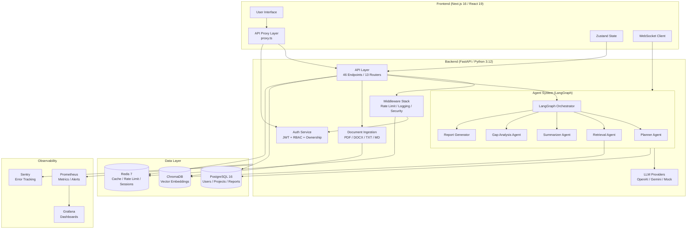
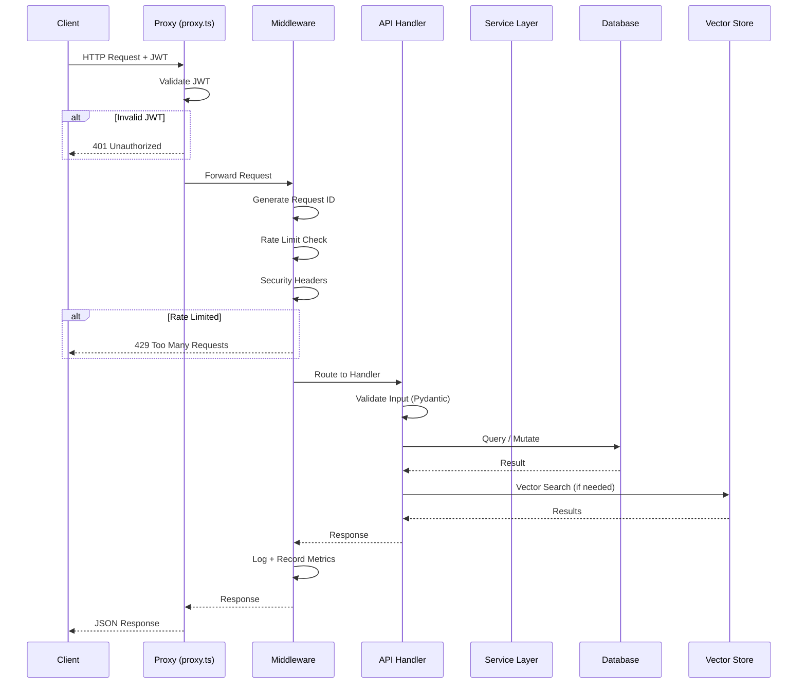
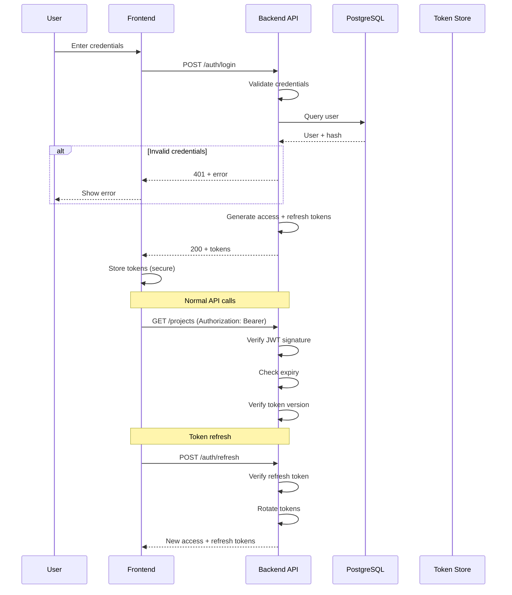
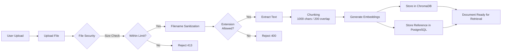
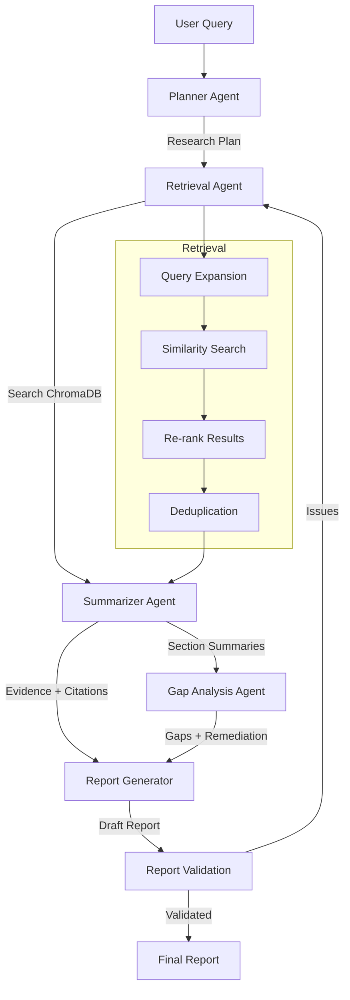
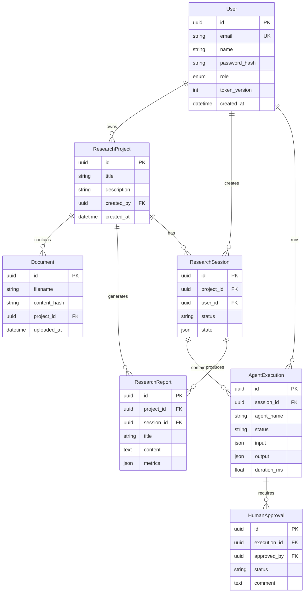

# System Architecture

## High-Level Architecture

```mermaid
graph TB
    subgraph Frontend["Frontend (Next.js 16 / React 19)"]
        UI[User Interface]
        Proxy[API Proxy Layer<br/>proxy.ts]
        Store[Zustand State]
        WS[WebSocket Client]
    end

    subgraph Backend["Backend (FastAPI / Python 3.12)"]
        direction TB
        API[API Layer<br/>46 Endpoints / 13 Routers]
        Auth[Auth Service<br/>JWT + RBAC + Ownership]
        Middleware[Middleware Stack<br/>Rate Limit / Logging / Security]
        
        subgraph Agents["Agent System (LangGraph)"]
            Planner[Planner Agent]
            Retriever[Retrieval Agent]
            Summarizer[Summarizer Agent]
            Analyzer[Gap Analysis Agent]
            Generator[Report Generator]
            Orchestrator[LangGraph Orchestrator]
        end
        
        Ingestion[Document Ingestion<br/>PDF / DOCX / TXT / MD]
        LLM[LLM Providers<br/>OpenAI / Gemini / Mock]
    end

    subgraph Storage["Data Layer"]
        PG[(PostgreSQL 16<br/>Users / Projects / Reports)]
        CB[(ChromaDB<br/>Vector Embeddings)]
        RD[(Redis 7<br/>Cache / Rate Limit / Sessions)]
    end

    subgraph Monitoring["Observability"]
        PM[Prometheus<br/>Metrics / Alerts]
        GF[Grafana<br/>Dashboards]
        SN[Sentry<br/>Error Tracking]
    end

    %% Frontend -> Backend
    UI --> Proxy
    Proxy --> API
    Proxy --> Auth
    Store --> API
    WS --> Agents

    %% Backend internals
    API --> Middleware
    Middleware --> Auth
    API --> Orchestrator
    Orchestrator --> Planner
    Orchestrator --> Retriever
    Orchestrator --> Summarizer
    Orchestrator --> Analyzer
    Orchestrator --> Generator
    API --> Ingestion
    Agents --> LLM
    
    %% Backend -> Storage
    API --> PG
    Agents --> PG
    Ingestion --> CB
    Retriever --> CB
    API --> RD
    Middleware --> RD

    %% Observability
    Backend --> PM
    PM --> GF
    Backend --> SN
```

## Request Lifecycle

```mermaid
sequenceDiagram
    participant C as Client
    participant P as Proxy (proxy.ts)
    participant M as Middleware
    participant A as API Handler
    participant S as Service Layer
    participant D as Database
    participant V as Vector Store

    C->>P: HTTP Request + JWT
    P->>P: Validate JWT
    alt Invalid JWT
        P-->>C: 401 Unauthorized
    end
    
    P->>M: Forward Request
    M->>M: Generate Request ID
    M->>M: Rate Limit Check
    M->>M: Security Headers
    
    alt Rate Limited
        M-->>C: 429 Too Many Requests
    end
    
    M->>A: Route to Handler
    A->>A: Validate Input (Pydantic)
    A->>D: Query / Mutate
    D-->>A: Result
    A->>V: Vector Search (if needed)
    V-->>A: Results
    A-->>M: Response
    M->>M: Log + Record Metrics
    M-->>P: Response
    P-->>C: JSON Response
```

## Authentication Flow

```mermaid
sequenceDiagram
    participant U as User
    participant F as Frontend
    participant B as Backend API
    participant DB as PostgreSQL
    participant T as Token Store

    U->>F: Enter credentials
    F->>B: POST /auth/login
    
    B->>B: Validate credentials
    B->>DB: Query user
    DB-->>B: User + hash
    
    alt Invalid credentials
        B-->>F: 401 + error
        F-->>U: Show error
    end
    
    B->>B: Generate access + refresh tokens
    B-->>F: 200 + tokens
    F->>F: Store tokens (secure)
    
    Note over F,B: Normal API calls
    F->>B: GET /projects (Authorization: Bearer)
    B->>B: Verify JWT signature
    B->>B: Check expiry
    B->>B: Verify token version
    
    Note over F,B: Token refresh
    F->>B: POST /auth/refresh
    B->>B: Verify refresh token
    B->>B: Rotate tokens
    B-->>F: New access + refresh tokens
```

## Document Processing Pipeline

```mermaid
flowchart LR
    U[User Upload] --> UF[Upload File]
    UF --> FS{File Security}
    FS -->|Size Check| SL{Within Limit?}
    SL -->|Yes| SN[Filename Sanitization]
    SL -->|No| REJ[Reject 413]
    SN --> EXT{Extension<br/>Allowed?}
    EXT -->|Yes| EX[Extract Text]
    EXT -->|No| REJ2[Reject 400]
    EX --> CH[Chunking<br/>1000 chars / 200 overlap]
    CH --> EM[Generate Embeddings]
    EM --> ST[Store in ChromaDB]
    EM --> SR[Store Reference in PostgreSQL]
    ST --> OK[Document Ready for Retrieval]
    SR --> OK
```

## Research Generation Pipeline

```mermaid
flowchart TB
    Q[User Query] --> P[Planner Agent]
    P -->|Research Plan| R[Retrieval Agent]
    R -->|Search ChromaDB| S[Summarizer Agent]
    S -->|Section Summaries| A[Gap Analysis Agent]
    S -->|Evidence + Citations| G[Report Generator]
    A -->|Gaps + Remediation| G
    G -->|Draft Report| V[Report Validation]
    V -->|Validated| F[Final Report]
    V -->|Issues| R
    
    subgraph Retrieval
        RQ[Query Expansion]
        SQ[Similarity Search]
        RN[Re-rank Results]
        DD[Deduplication]
    end
    
    R --> RQ
    RQ --> SQ
    SQ --> RN
    RN --> DD
    DD --> S
```

## Data Model

```mermaid
erDiagram
    User ||--o{ ResearchProject : owns
    User ||--o{ ResearchSession : creates
    User ||--o{ AgentExecution : runs
    
    ResearchProject ||--o{ Document : contains
    ResearchProject ||--o{ ResearchReport : generates
    ResearchProject ||--o{ ResearchSession : has
    
    ResearchSession ||--o{ AgentExecution : contains
    ResearchSession ||--o{ ResearchReport : produces
    
    AgentExecution ||--o{ HumanApproval : requires
    
    User {
        uuid id PK
        string email UK
        string name
        string password_hash
        enum role
        int token_version
        datetime created_at
    }
    
    ResearchProject {
        uuid id PK
        string title
        string description
        uuid created_by FK
        datetime created_at
    }
    
    Document {
        uuid id PK
        string filename
        string content_hash
        uuid project_id FK
        datetime uploaded_at
    }
    
    ResearchSession {
        uuid id PK
        uuid project_id FK
        uuid user_id FK
        string status
        json state
    }
    
    AgentExecution {
        uuid id PK
        uuid session_id FK
        string agent_name
        string status
        json input
        json output
        float duration_ms
    }
    
    ResearchReport {
        uuid id PK
        uuid project_id FK
        uuid session_id FK
        string title
        text content
        json metrics
    }
    
    HumanApproval {
        uuid id PK
        uuid execution_id FK
        uuid approved_by FK
        string status
        text comment
    }
```
